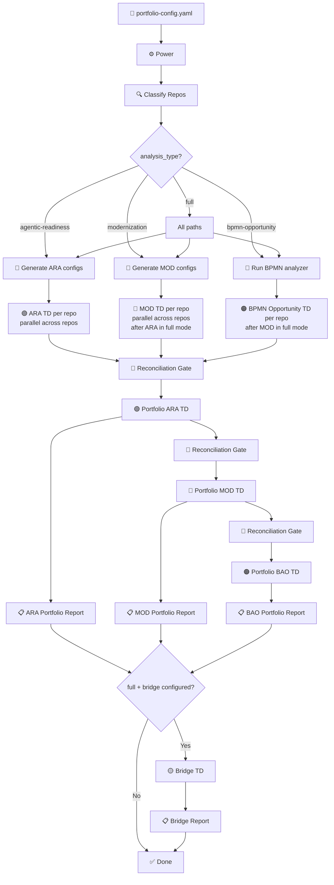
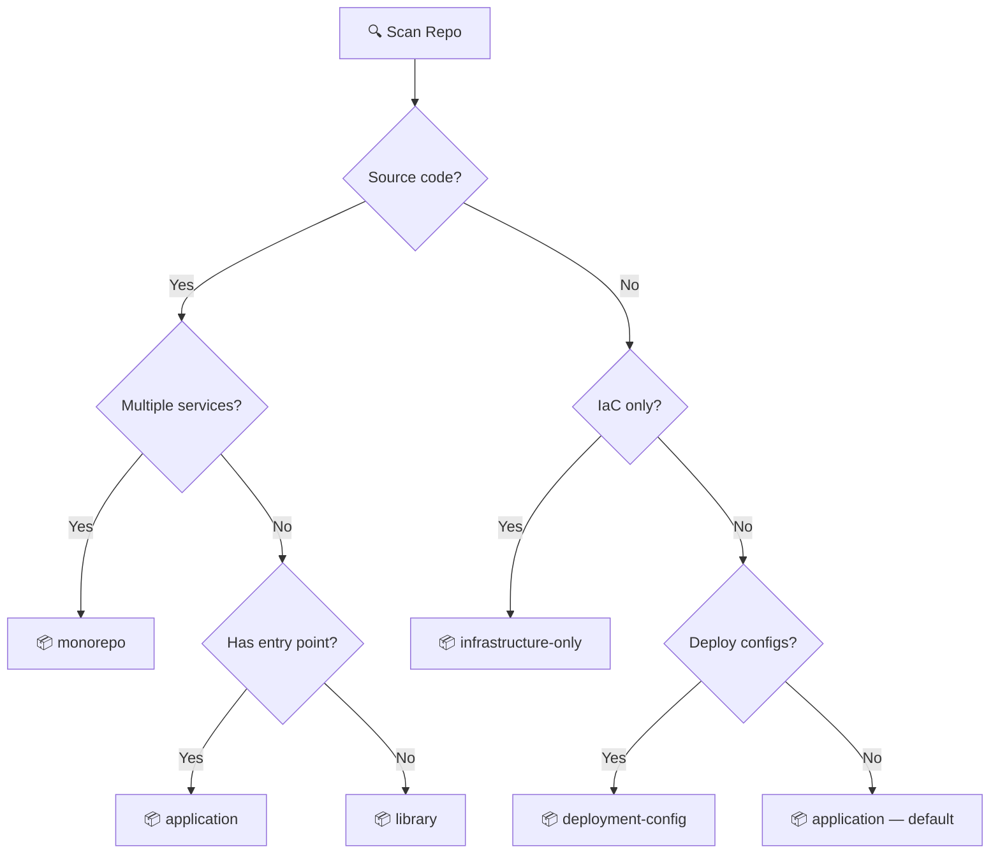
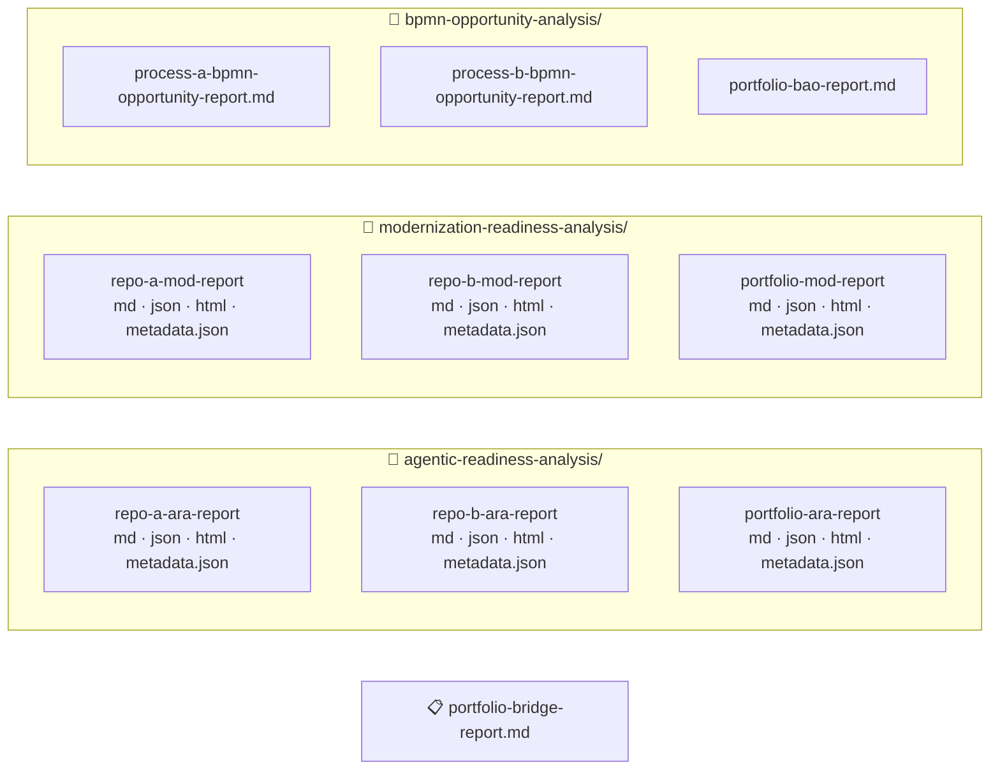

# Portfolio Analysis Orchestrator

> Automated analysis of your service portfolio for agentic AI readiness, cloud-native modernization, and agentic opportunity identification from BPMN process models -- three dedicated analyses (ARA + MOD + BAO) with portfolio-level cross-cutting analysis, dependency-aware roadmaps, a unified bridge report, and consolidated reports.

This project provides seven [AWS Transform](https://docs.aws.amazon.com/transform/) (ATX) custom transformation definitions and a [Kiro](https://kiro.dev) Power that orchestrates them across multiple repositories.

## Architecture

There are two layers:

1. **ATX Custom Transformation Definitions** — the analysis logic published to your AWS Transform registry (7 TDs)
2. **Kiro Power** — an orchestrator that reads `portfolio-config.yaml`, classifies repos, generates ATX configs, spawns parallel subagents, and consolidates reports

### Three-Analysis Architecture (+ Bridge)

| Analysis | Questions | Scoring | Focus |
|---|---|---|---|
| **MOD** (Modernization Readiness) | 37 across 5 sections | 1-4 scale | Scans portfolios for cloud-native maturity gaps and maps findings to AWS modernization pathways. |
| **ARA** (Agentic Readiness) | 43 across 8 sections | BLOCKER / RISK / INFO | Evaluates whether systems are ready to be safely called by AI agents — covering APIs, identity, state management, human-in-the-loop, and observability. |
| **BAO** (BPMN Agentic Opportunity) | Per-task scoring | 4 categories + autonomy levels | Which process steps should become agents? |
| **Bridge** | — | Cross-reference | What work is shared? What's the modernization dividend for agentic readiness? |

Zero question overlap between ARA and MOD. The `analysis_type` field routes which analyses run:
- `agentic-readiness` -> ARA only
- `modernization` -> MOD only
- `bpmn-opportunity` -> BAO only (requires `.bpmn` files)
- `full` -> all analyses in parallel

### Analysis Flow

> **Per-repo execution model.** Subagents run **in parallel across repositories** but TDs are sequenced **within each repository** in `full` mode (ARA → MOD → BAO). Concurrent ATX runs against the same repo path fork divergent staging branches and lose artifacts. Portfolio TDs (Portfolio ARA → Portfolio MOD → Portfolio BAO → Bridge) run **strictly serially** with a Reconciliation Gate between each. See `orchestrator/POWER.md` for the full safety contracts.



### Repo Classification

The Power classifies each repo before spawning subagents. Classification determines N/A question mappings in both TDs. User override via `repo_type` in config always takes precedence.



### Config → ATX Config Generation


> `agent_scope` is ARA-only (drives conditional BLOCKERs). `service_archetype` is ARA-only (determines core/extended question tiers). `preferences` is MOD-only (frames recommendations). `repo_type`, `context`, `priority`, and `tags` are shared.

### Report Output

Every per-repo and portfolio analysis emits a **four-artifact bundle**: `.md` (richest narrative), `.json` (canonical machine-readable contract for the dashboard and downstream TDs), `.html` (single self-contained visualization), and `.metadata.json` (version compatibility sidecar). The `.json` artifact is authoritative if the four ever disagree.



> The bridge report is generated at the portfolio root when `analysis_type: full` and `portfolio_bridge` is configured. It cross-references the ARA, MOD, and (when available) BPMN portfolio reports to produce shared remediation mappings, agentic readiness delta, deduplicated findings, and a BPMN opportunity + ARA readiness matrix.

## Getting Started

### Prerequisites

- Valid AWS credentials (`aws sts get-caller-identity` -- the orchestrator checks this first and fails fast if expired)
- [AWS Transform CLI](https://docs.aws.amazon.com/transform/) installed (`atx --version`)
- [Kiro IDE](https://kiro.dev) with the Portfolio Analysis Orchestrator power installed

### Step 1: Publish the ATX Transformation Definitions

> **Publish serially, not in parallel.** The atx CLI uses a shared tar staging path (`~/tmp/transformation.tar`). Concurrent `atx custom def publish` commands overwrite each other and produce ENOENT or 400 upload errors. Run the seven publish commands one at a time.

```bash
# Individual analyses
atx custom def publish -n agentic-readiness-analysis --sd definitions/ara \
  --description "Evaluate a repository against 43 agentic readiness criteria (BLOCKER/RISK/INFO)"

atx custom def publish -n modernization-readiness-analysis --sd definitions/mod \
  --description "Evaluate a repository against 37 modernization criteria (1-4 scale)"

atx custom def publish -n bpmn-opportunity-analysis --sd definitions/bao \
  --description "Analyze BPMN 2.0 process models to identify agentic AI opportunities with cost estimates"

# Portfolio aggregations
atx custom def publish -n portfolio-agentic-readiness --sd definitions/portfolio-ara \
  --description "Aggregate ARA reports into portfolio-level cross-cutting analysis"

atx custom def publish -n portfolio-modernization --sd definitions/portfolio-mod \
  --description "Aggregate MOD reports into portfolio-level roadmap and analysis"

atx custom def publish -n portfolio-bpmn-opportunity --sd definitions/portfolio-bao \
  --description "Aggregate BAO reports into portfolio-level opportunity analysis"

# Bridge (optional — for full analyses)
atx custom def publish -n portfolio-bridge --sd definitions/bridge \
  --description "Cross-reference portfolio ARA and MOD reports into a unified bridge report"
```

Verify: `atx custom def list`

### Step 2: Install the Kiro Power

The Kiro Power lives at [`orchestrator/POWER.md`](orchestrator/POWER.md) and registers in Kiro as the `orchestrator` power (display name: **Portfolio Analysis Orchestrator**).

To install:

1. Open Kiro IDE
2. Open the Powers panel
3. Add a custom power from local directory and point Kiro at the `orchestrator/` directory of this repository

### Step 3: Create Your Portfolio Configuration

```yaml
portfolio_name: "my-platform"
analysis_type: "full"
context: "Building customer-facing AI agents while modernizing infrastructure"
agent_scope: "write-enabled"

transformation_definitions:
  agentic_readiness: "agentic-readiness-analysis"
  modernization: "modernization-readiness-analysis"
  bpmn_opportunity: "bpmn-opportunity-analysis"
  portfolio_agentic_readiness: "portfolio-agentic-readiness"
  portfolio_modernization: "portfolio-modernization"
  portfolio_bpmn_opportunity: "portfolio-bpmn-opportunity"
  portfolio_bridge: "portfolio-bridge"  # optional — for full analyses

preferences:
  prefer: ["eks", "aurora", "bedrock"]
  avoid: ["self-managed-kafka", "oracle"]

repositories:
  - name: "service-a"
    repository_url: "https://github.com/org/service-a.git"
    path: "./services/service-a"
    priority: "P0"
  - name: "service-b"
    path: "./services/service-b"
    priority: "P1"

dependency_overrides:
  - source: "service-a"
    target: "service-b"
    type: "sync"
    description: "REST API calls"
```

See `portfolio-config.yaml` for a complete example and `portfolio-config.schema.json` for the full schema.

### Step 4: Run the Analysis

In Kiro chat:

```
Run the portfolio analysis orchestrator on portfolio-config.yaml
```

Kiro handles cloning, classification, config generation, parallel execution, and report consolidation.

**What Kiro does for you, beyond the obvious.** The orchestrator enforces three safety contracts that prevent silent data loss in long-running ATX runs: a no-polling contract for subagents, per-repo serialization within `full` mode, and strictly serial portfolio TDs gated by a reconciliation step. Read [`orchestrator/POWER.md`](orchestrator/POWER.md) for the full contracts and the seven steering files for runbook-level depth.


### Step 5 (Alternative): Run Manually Without Kiro

```bash
# Individual ARA (per repo)
atx custom def exec -n agentic-readiness-analysis -p ./services/my-service -g file://atx-config-ara.yaml -x -t

# Individual MOD (per repo)
atx custom def exec -n modernization-readiness-analysis -p ./services/my-service -g file://atx-config-mod.yaml -x -t

# BPMN Opportunity (per repo with .bpmn files — run analyzer first)
cd ./services/my-service
python tools/bpmn-analyzer/run_analysis.py --bpmn process.bpmn --output analysis.json
atx custom def exec -n bpmn-opportunity-analysis -p . -g file://atx-config-bpmn.yaml -x -t

# Portfolio ARA (after all individual ARA analyses)
atx custom def exec -n portfolio-agentic-readiness -p . -g file://atx-portfolio-ara-config.yaml -x -t

# Portfolio MOD (after all individual MOD analyses)
atx custom def exec -n portfolio-modernization -p . -g file://atx-portfolio-mod-config.yaml -x -t

# Bridge (after both portfolio analyses — full analysis only)
atx custom def exec -n portfolio-bridge -p . -g file://atx-config-bridge.yaml -x -t
```

Always use `-x` (non-interactive) and `-t` (trust all tools) for batch execution.

## Project Structure

```
├── definitions/                        # All ATX Transformation Definitions
│   ├── ara/                            # ARA TD (43 questions, BLOCKER/RISK/INFO)
│   ├── mod/                            # MOD TD (37 questions, 1-4 scale)
│   ├── bao/                            # BAO TD (BPMN Agentic Opportunity)
│   ├── portfolio-ara/                  # Portfolio ARA TD (cross-cutting analysis)
│   ├── portfolio-mod/                  # Portfolio MOD TD (dependency-aware roadmap)
│   ├── portfolio-bao/                  # Portfolio BAO TD (opportunity aggregation)
│   └── bridge/                         # Bridge TD (ARA + MOD + BAO cross-reference)
├── tools/
│   └── bpmn-analyzer/                  # Deterministic BPMN analysis engine (Python)
│       ├── run_analysis.py             # Entry point: BPMN file -> JSON report
│       ├── parser/                     # BPMN 2.0 XML parsing (version detection)
│       ├── analyzer/                   # Constraint extraction, dependency discovery
│       │   ├── constraint_extractor.py
│       │   ├── dependency_extractor.py
│       │   ├── exceptions.py
│       │   └── vendors/               # Vendor-specific extractors (auto-discovered)
│       │       ├── camunda_c7.py
│       │       ├── camunda_c8.py
│       │       └── jbpm.py
│       ├── augmentor/                  # Task scoring, classification, cost estimation
│       ├── samples/                    # Sample BPMN files (loan, KYC, Camunda invoice)
│       ├── tests/                      # 58 tests
│       └── README.md
├── orchestrator/                       # Kiro Power (orchestration logic)
│   └── POWER.md
├── examples/
│   ├── portfolio-config.yaml           # Example portfolio config
│   ├── demo-bao-portfolio-config.yaml  # Demo config with open source BPMN repos
│   ├── fixtures/
│   │   └── monolith/                   # PHP test fixture (out-of-box testing)
│   ├── dashboard/                      # HTML dashboards (deployed to CloudFront)
│   │   ├── agentic-readiness.html
│   │   ├── modernization.html
│   │   ├── bpmn-opportunity.html
│   │   ├── bridge.html
│   │   ├── index.html
│   │   └── cloudformation.yaml
│   └── reports/                        # Generated example reports
│       ├── online-boutique/            # 11 microservices with delta tracking
│       ├── bao-demo/                   # BAO POC (5 BPMN repos)
│       └── v3-full-analysis/         # Full analysis across 5 repos
├── portfolio-config.schema.json        # Input contract (JSON schema)
├── static/                             # Static assets
└── README.md
```

## Example Reports

The `examples/reports/` directory contains complete sets of reports:

### Full Analysis (5 repos)

Per-repo and portfolio reports each ship as a four-file bundle (`.md` + `.json` + `.html` + `.metadata.json`). The tree below shows the canonical filename stem for each report; every stem has all four extensions on disk.

```
examples/reports/v2-full-analysis/
├── portfolio-config.yaml
├── ecommerce-platform-v2-bridge-report.{md,json,html,metadata.json}
├── agentic-readiness-analysis/
│   ├── MonoToMicroLegacy-ara-report.{md,json,html,metadata.json}
│   ├── aws-microservices-ara-report.{md,json,html,metadata.json}
│   ├── books-api-ara-report.{md,json,html,metadata.json}
│   ├── eks-saas-gitops-ara-report.{md,json,html,metadata.json}
│   ├── monolith-ara-report.{md,json,html,metadata.json}
│   └── ecommerce-platform-v2-portfolio-ara-report.{md,json,html,metadata.json}
└── modernization-readiness-analysis/
    ├── MonoToMicroLegacy-mod-report.{md,json,html,metadata.json}
    ├── aws-microservices-mod-report.{md,json,html,metadata.json}
    ├── books-api-mod-report.{md,json,html,metadata.json}
    ├── eks-saas-gitops-mod-report.{md,json,html,metadata.json}
    ├── monolith-mod-report.{md,json,html,metadata.json}
    └── ecommerce-platform-v2-portfolio-mod-report.{md,json,html,metadata.json}
```

### Online Boutique (11 microservices)

```
examples/reports/online-boutique/
├── portfolio-config.yaml
├── agentic-readiness.html              # Interactive dashboard (also deployed to CloudFront)
├── modernization.html                  # MOD dashboard
├── agentic-readiness-analysis/       # ARA reports (original code — 43 questions, archetypes)
│   ├── frontend-ara-report.{md,json,html,metadata.json}
│   ├── cartservice-ara-report.{md,json,html,metadata.json}
│   ├── ... (11 individual + 1 portfolio)
│   └── online-boutique-portfolio-ara-report.{md,json,html,metadata.json}
├── agentic-readiness-analysis-v2/    # ARA reports (after remediation — Istio, OTel, etc.)
│   ├── frontend-ara-report.{md,json,html,metadata.json}
│   ├── cartservice-ara-report.{md,json,html,metadata.json}
│   ├── ... (11 individual + 1 portfolio)
│   └── online-boutique-portfolio-ara-report.{md,json,html,metadata.json}
└── modernization-readiness-analysis/           # MOD reports
    └── ... (11 individual + 1 portfolio)
```

The two ARA report folders enable delta tracking — comparing analysis results before and after remediation changes (Istio mTLS, OTel, proto versioning, data classification, HPAs, monitoring alerts).

## Dashboard

The `examples/dashboard/` directory contains interactive HTML dashboards deployed to CloudFront:

- **ARA Dashboard** -- Analysis run selector, readiness profiles, cross-cutting analysis, pilot candidate ranking, agentic program recommendations (AgentStorming, AXE, EBA), delta comparison between runs
- **MOD Dashboard** -- Category scores, pathway summary, 4-phase roadmap, technology stack, radar chart
- **Bridge Dashboard** -- Shared remediation mapping, agentic readiness delta, MOD readiness gates, unified remediation sequence
- **BAO Dashboard** -- Agent opportunity classification (build-now / data-first / automate / platform), dependency discovery by vendor, implementation waves, Bedrock consumption forecast

Live at: **https://d2fplme21ym2t.cloudfront.net**

Deploy updates:
```bash
aws s3 sync examples/dashboard/ s3://936068047509-dashboard/ --delete --exclude "cloudformation.yaml" --exclude "README.md" --content-type "text/html"
aws cloudfront create-invalidation --distribution-id E36HDAABDBBG66 --paths "/*"
```

## Local Monolith (Test Fixture)

The `examples/fixtures/monolith/` directory contains a simple PHP application used as a test fixture so you can run analyses out of the box without cloning external repos.

## Managing Transformation Definitions

```bash
# List
atx custom def list

# Update (delete + re-publish)
atx custom def delete -n agentic-readiness-analysis
atx custom def publish -n agentic-readiness-analysis --sd definitions/ara \
  --description "Evaluate a repository against 43 agentic readiness criteria (BLOCKER/RISK/INFO)"

# Update bridge TD
atx custom def delete -n portfolio-bridge
atx custom def publish -n portfolio-bridge --sd definitions/bridge \
  --description "Cross-reference portfolio ARA and MOD reports into a unified bridge report"

# Get details
atx custom def get -n agentic-readiness-analysis
```

## Contributing

We welcome contributions that improve existing transformation definitions or propose new ones. Use the GitHub issue templates:

- **[Improve Existing TD](../../issues/new?template=improve-transformation-definition.yml)**
- **[Propose New TD](../../issues/new?template=new-transformation-definition.yml)**

See [CONTRIBUTING.md](CONTRIBUTING.md) for general guidelines.

## Security

See [SECURITY.md](SECURITY.md) for security guidelines and [THREAT_MODEL.docx](THREAT_MODEL.docx) for the threat analysis. Treat analysis reports as confidential — they contain architecture details.

## Related Resources

- [AWS Transform Documentation](https://docs.aws.amazon.com/transform/)
- [AWS Transform CLI Reference](https://docs.aws.amazon.com/transform/latest/userguide/custom-command-reference.html)
- [AWS Modernization Pathways](https://skillbuilder.aws/learning-plan)
- [Cloud Design Patterns](https://docs.aws.amazon.com/prescriptive-guidance/latest/cloud-design-patterns/)
- [AWS Well-Architected Framework](https://aws.amazon.com/architecture/well-architected/)

## License

This library is licensed under the MIT-0 License. See the [LICENSE](LICENSE) file.
