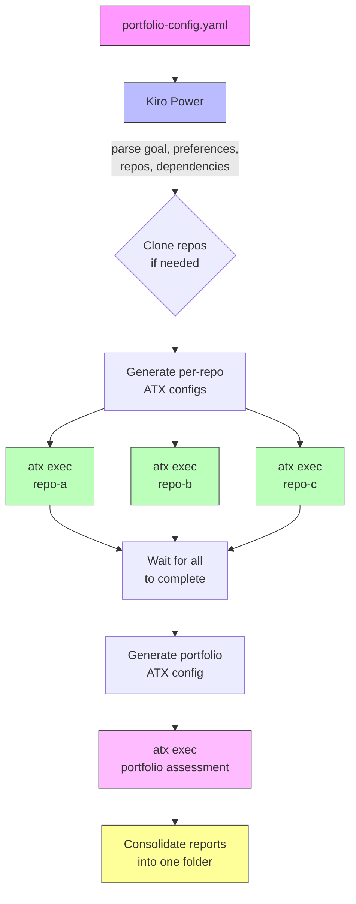

# Agentic Readiness Assessment

Evaluate your service portfolio's readiness for agentic AI adoption. This project provides two AWS Transform (ATX) custom transformation definitions and a Kiro Power that orchestrates them across multiple repositories to produce individual and portfolio-level readiness reports.

## What's in This Repo

```
.
├── agentic-assessment-orchestrator/          # Kiro Power — orchestrates assessments
│   └── POWER.md                              #   Power definition and documentation
├── individual-aws-agentic-assessment/        # ATX transformation: individual repo assessment
│   └── transformation_definition.md          #   56 criteria across 5 categories
├── portfolio-agentic-assessment/             # ATX transformation: portfolio aggregation
│   └── transformation_definition.md          #   Cross-service analysis and roadmap
├── portfolio-config.schema.json              # JSON Schema for portfolio config validation
├── example-reports/                          # Example configs and output per goal
│   ├── goal-agentic-readiness/               #   Default equal-weight assessment
│   │   └── portfolio-config.yaml
│   ├── goal-cloud-native-modernization/      #   EKS/containers modernization (full run)
│   │   ├── portfolio-config.yaml
│   │   ├── cloud-native-modernization-portfolio-agentic-readiness-report.md
│   │   ├── eks-saas-gitops-agentic-readiness-report.md
│   │   ├── monolith-agentic-readiness-report.md
│   │   └── MonoToMicroLegacy-agentic-readiness-report.md
│   ├── goal-cost-optimization/               #   Cost reduction focus
│   │   └── portfolio-config.yaml
│   └── goal-enable-agentic-use-case/         #   Specific agentic AI use case
│       └── portfolio-config.yaml
├── monolith/                                 # Local PHP monolith (test fixture)
│   ├── index.php, Dockerfile, docker-compose.yml
│   └── infrastructure/monolith-apprunner.yaml
├── dashboard-generator/                      # HTML dashboard generator
│   └── generate_dashboard.py
├── static/                                   # Documentation images
└── README.md
```

## How It Works

There are two layers:

1. **ATX Custom Transformation Definitions** — the actual assessment logic published to your AWS Transform registry
2. **Kiro Power** — an orchestrator that reads a `portfolio-config.yaml`, generates ATX config files with `additionalPlanContext`, spawns parallel subagents for individual assessments, then runs the portfolio aggregation

### Assessment Flow



Each individual assessment evaluates 56 criteria across 5 categories:
- Infrastructure & Platform (10 criteria)
- Application Architecture (13 criteria)
- Data Foundations (11 criteria)
- Identity, Security & Governance (10 criteria)
- Operations & Observability (12 criteria)

The portfolio assessment then aggregates results, maps service dependencies, identifies cross-cutting concerns, and produces a phased modernization roadmap.

## Goal-Driven Assessment (V2)

V2 introduces a **goal-driven priority lens** that re-weights the assessment based on the customer's modernization objective. Instead of treating all 56 criteria equally, the goal determines which pathways are highlighted, how the roadmap is phased, and which report sections appear.

### Predefined Goals

| Goal | Description | Primary Pathways |
|------|-------------|-----------------|
| `agentic-readiness` | Evaluate overall agentic readiness across all dimensions with equal weighting (default) | All pathways evaluated equally |
| `enable-agentic-use-case` | Enable a specific agentic AI use case — scoped to the identified use case being built | Move to AI, Move to Managed Databases, Move to Modern DevOps |
| `cost-optimization` | Reduce costs through license elimination, managed service adoption, and right-sizing | Move to Open Source, Move to Managed Databases, Move to Managed Analytics |
| `cloud-native-modernization` | Decompose and modernize into cloud-native architectures using managed services, containers, and serverless | Move to Cloud Native, Move to Containers, Move to Modern DevOps |

The goal is a **priority lens**, not a filter — all 7 pathways are still evaluated for every repo. The goal changes which pathways are highlighted as primary, how roadmap phases are named, which criteria are emphasized in the Top 5 Critical Gaps, and whether certain report sections appear (decomposition guidance, Quick Agent Wins).

If none of the predefined goals fit, use `agentic-readiness` with a detailed `goal_context` to guide the assessment.

### `goal_context` Field

An optional free-text field that provides additional context for scoping recommendations. Example:

```yaml
goal_context: "Building a customer support agent that needs access to our order and inventory data"
```

This influences:
- **Quick Agent Wins** — what specific agent use cases to suggest
- **Recommendation framing** — how findings are presented relative to the stated context
- **Portfolio service prioritization** — which services matter most for the stated objective

### Repository Type Classification

The assessment auto-detects the repository type during discovery and adjusts scoring accordingly. Criteria that don't apply to the detected repo type are scored as N/A and excluded from category averages.

| Type | Description | Example |
|------|-------------|---------|
| `application` | Contains application source code (default) | Java service, Python API |
| `infrastructure-only` | Only IaC, no application code | Terraform modules, CDK stacks |
| `deployment-cicd` | CI/CD pipelines, deployment scripts only | GitHub Actions, Jenkinsfiles |
| `monorepo` | Multiple services/apps in one repo | Monorepo with services/ dirs |
| `library` | Shared library/SDK, not deployable | Internal SDK, shared utilities |

Auto-detection uses file composition analysis (source code files, IaC files, CI/CD definitions, build configs, package manifests). You can override auto-detection by setting the `repo_type` field in your portfolio config:

```yaml
repositories:
  - name: "infra-repo"
    path: "./infrastructure"
    repo_type: "infrastructure-only"
```

## Getting Started

### Prerequisites

- [AWS Transform CLI](https://docs.aws.amazon.com/transform/) installed (`atx --version`)
- [Kiro IDE](https://kiro.dev) with the Agentic Assessment Orchestrator power installed

### Step 1: Publish the ATX Transformation Definitions

The two transformation definitions need to be published to your AWS Transform registry:

```bash
# Publish the individual repository assessment
atx custom def publish \
  -n agentic-readiness-assessment \
  --sd individual-aws-agentic-assessment \
  --description "Evaluate a code repository against 56 agentic readiness criteria"

# Publish the portfolio aggregation assessment
atx custom def publish \
  -n portfolio-agentic-readiness-assessment \
  --sd portfolio-agentic-assessment \
  --description "Aggregate individual assessments into portfolio-level analysis"
```

Verify they're available:

```bash
atx custom def list
```

You should see both under "User Transformations". The names you choose here must match what you put in `transformation_definitions` in your portfolio config.

### Step 2: Install the Kiro Power

The `agentic-assessment-orchestrator/` directory is a Kiro Power. To install it:

1. Open Kiro IDE
2. Open the Powers panel (click the Powers icon in the sidebar or use the command palette)
3. Click "Configure" to open the powers management panel
4. Add the `agentic-assessment-orchestrator` power from this repository — point it to the `agentic-assessment-orchestrator/` directory

Once installed, Kiro will have access to the orchestration logic defined in `POWER.md`, including how to parse your portfolio config, generate ATX configs, and coordinate parallel assessments.

### Step 3: Create Your Portfolio Configuration

Create a `portfolio-config.yaml` in a working directory or use one of the examples from `example-reports/`:

```yaml
portfolio_name: "my-platform"
goal: "enable-agentic-use-case"
goal_context: "Building customer-facing AI agents"

transformation_definitions:
  individual_assessment: "agentic-readiness-assessment"
  portfolio_assessment: "portfolio-agentic-readiness-assessment"

preferences:
  prefer: ["eks", "aurora", "bedrock"]
  avoid: ["self-managed-kafka"]

repositories:
  - name: "service-a"
    path: "./services/a"
    priority: "P0"
  - name: "service-b"
    path: "./services/b"
    priority: "P1"
```

Key fields:
- `goal` — one of `agentic-readiness`, `enable-agentic-use-case`, `cost-optimization`, `cloud-native-modernization`. Defaults to `agentic-readiness` if omitted.
- `goal_context` — optional free-text that influences recommendation framing and Quick Agent Wins
- `preferences.prefer` / `preferences.avoid` — flat arrays replacing all previous nested constraint objects
- Per-repo optional fields: `priority`, `context`, `preferences` (merges with global), `repo_type`, `tags`, `repository_url`, `report_path`

Repositories can be already cloned locally (just set `path`) or auto-cloned by Kiro (set `repository_url` and `path`).

See `example-reports/` for complete portfolio configs for each predefined goal.

### Step 4: Run the Assessment via Kiro

In Kiro chat, ask:

```
Run the agentic assessment orchestrator on portfolio-config.yaml
```

Kiro will:
1. Parse the config and read `transformation_definitions` for the ATX names
2. Clone repos where `repository_url` is provided and `path` doesn't exist
3. Generate a temporary `.atx-config-<service>.yaml` per repo with `additionalPlanContext` (merging global + per-service preferences)
4. Spawn parallel subagents running `atx custom def exec -n <individual_assessment> -p <repo> -g file://<config> -x -t`
5. Wait for all to complete (5–15 min per repo)
6. Generate `.atx-config-portfolio.yaml` with the full service inventory
7. Run `atx custom def exec -n <portfolio_assessment> -p . -g file://<portfolio-config> -x -t`
8. Consolidate all reports into the output folder and clean up temp files


### Step 5 (Alternative): Run Manually Without Kiro

You can also run the ATX transformations directly:

```bash
# Individual assessment (repeat per repo)
atx custom def exec -n agentic-readiness-assessment -p ./services/my-service -x -t

# With additional context via config file
atx custom def exec -n agentic-readiness-assessment -p ./services/my-service -g file://atx-config.yaml -x -t

# Portfolio assessment (after all individual assessments complete)
atx custom def exec -n portfolio-agentic-readiness-assessment -p . -g file://atx-portfolio-config.yaml -x -t
```

Always use `-x` (non-interactive) and `-t` (trust all tools) for batch execution.

## Example Reports

The `example-reports/` directory contains portfolio configs for each predefined goal, plus a complete set of generated reports for the `cloud-native-modernization` goal:

```
example-reports/
├── goal-agentic-readiness/
│   └── portfolio-config.yaml
├── goal-cloud-native-modernization/          # Full run with reports
│   ├── portfolio-config.yaml
│   ├── cloud-native-modernization-portfolio-agentic-readiness-report.md
│   ├── eks-saas-gitops-agentic-readiness-report.md
│   ├── monolith-agentic-readiness-report.md
│   └── MonoToMicroLegacy-agentic-readiness-report.md
├── goal-cost-optimization/
│   └── portfolio-config.yaml
└── goal-enable-agentic-use-case/
    └── portfolio-config.yaml
```

The `goal-cloud-native-modernization` example assessed 3 repositories against the goal of decomposing monoliths into containerized microservices on EKS with GitOps deployment:

| Service | Score | Type | Priority |
|---------|-------|------|----------|
| eks-saas-gitops | 1.9/4.0 | EKS/Terraform/GitOps platform | P0 |
| local-monolith | 1.4/4.0 | PHP monolith | P1 |
| unishop-monolith | 1.2/4.0 | Java/Spring Boot monolith | P0 |
| **Portfolio Average** | **1.5/4.0** | | |

## Local Monolith (Test Fixture)

The `monolith/` directory contains a simple PHP application used as a test fixture. It includes:
- `index.php` — single-file PHP app
- `Dockerfile` and `docker-compose.yml` — container definitions
- `infrastructure/monolith-apprunner.yaml` — AWS App Runner config

This is included so you can run a portfolio assessment out of the box without needing to clone all external repos first (external repos get auto-cloned via `repository_url` in the portfolio config).

## Managing Transformation Definitions

### Update Definitions

If you modify the transformation definition markdown files, re-publish them:

```bash
# Delete old versions
atx custom def delete -n agentic-readiness-assessment
atx custom def delete -n portfolio-agentic-readiness-assessment

# Publish updated versions
atx custom def publish \
  -n agentic-readiness-assessment \
  --sd individual-aws-agentic-assessment \
  --description "Evaluate a code repository against 56 agentic readiness criteria"

atx custom def publish \
  -n portfolio-agentic-readiness-assessment \
  --sd portfolio-agentic-assessment \
  --description "Aggregate individual assessments into portfolio-level analysis"
```

### List Definitions

```bash
atx custom def list
```

### Get Definition Details

```bash
atx custom def get -n agentic-readiness-assessment
```

## Scoring Scale

| Score | Label | Meaning |
|-------|-------|---------|
| 4 | ✅ Agent-Ready | Fully meets criterion |
| 3 | 🟡 Partial | Minor gaps |
| 2 | 🟠 Needs Work | Significant gaps |
| 1 | ❌ Not Present | Missing or inadequate |

## Roadmap

1. **Custom output formats** — Allow transformation definitions to produce reports in configurable formats (JSON, CSV, SARIF) beyond Markdown, so teams can feed results into their existing dashboards and tooling
2. **Interactive HTML dashboard** — Auto-generate a visual portfolio dashboard from the assessment reports

## Related Resources

- [AWS Transform Documentation](https://docs.aws.amazon.com/transform/)
- [AWS Transform CLI Reference](https://docs.aws.amazon.com/transform/latest/userguide/custom-command-reference.html)
- [AWS Modernization Pathways](https://skillbuilder.aws/learning-plan)
- [Cloud Design Patterns](https://docs.aws.amazon.com/prescriptive-guidance/latest/cloud-design-patterns/)
- [AWS Well-Architected Framework](https://aws.amazon.com/architecture/well-architected/)

## Security

This project handles sensitive architecture and security assessment data. Please review our security guidelines before running assessments:

- **[Security Guidelines](SECURITY.md)** - Best practices for secure assessment execution
- **[Threat Model](THREAT_MODEL.md)** - Comprehensive security threat analysis
- **[Security Issue Reporting](CONTRIBUTING.md#security-issue-notifications)** - How to report vulnerabilities

**Key Security Practices:**
- Only assess repositories you have authorization to analyze
- Use Git credential managers and AWS IAM roles (never hardcode credentials)
- Treat assessment reports as confidential - they contain architecture details
- Run assessments in isolated development environments (not production)
- Validate repository URLs before cloning from external sources
- Review reports for credential exposure before sharing

See [SECURITY.md](SECURITY.md) for detailed guidance.

## License

This library is licensed under the MIT-0 License. See the [LICENSE](LICENSE) file.
