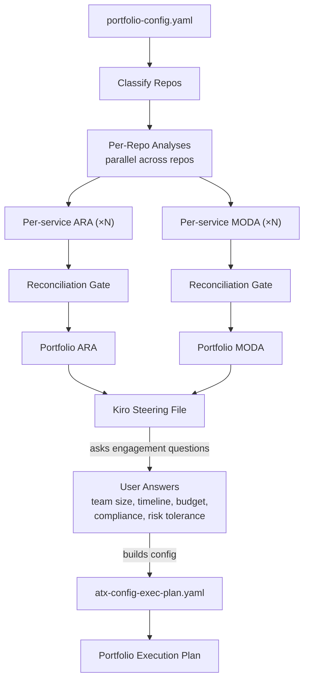
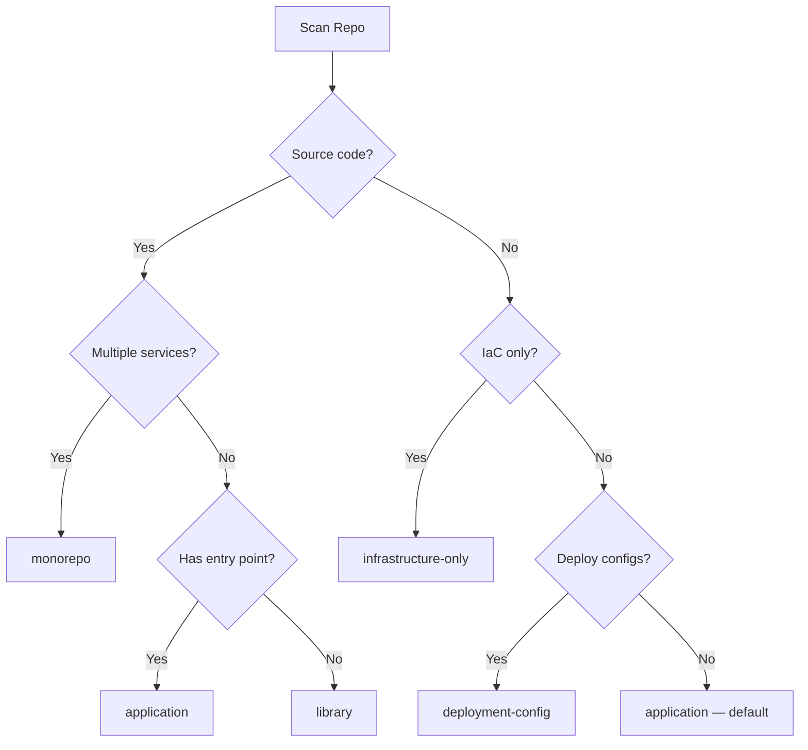
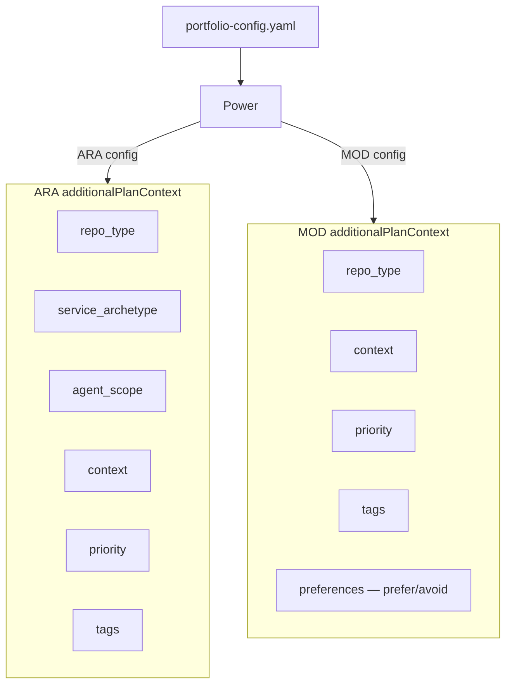
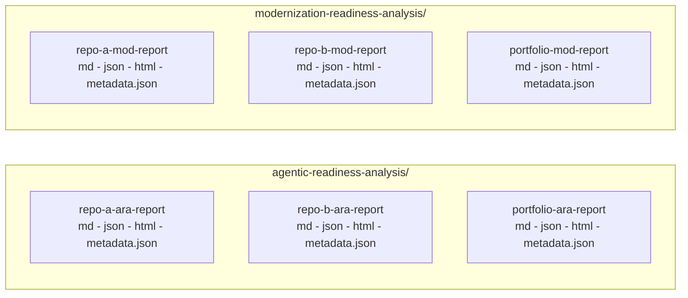
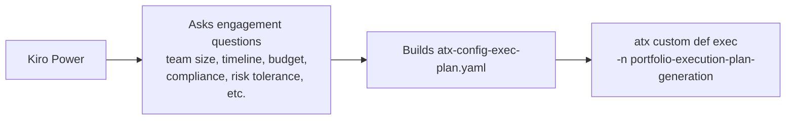

# Portfolio Analysis Orchestrator

> Automated analysis of your service portfolio for agentic AI readiness and cloud-native modernization -- two dedicated analyses (ARA + MOD) with portfolio-level cross-cutting analysis, dependency-aware roadmaps, consolidated reports, and execution plan generation.

This project provides a [Kiro](https://kiro.dev) Power that orchestrates [AWS Transform](https://docs.aws.amazon.com/transform/) managed transformation definitions across multiple repositories, plus example reports and interactive dashboards.

## Architecture

There are two layers:

1. **AWS Transform Managed Transformation Definitions** — published analysis logic available via `atx tp list` (early access)
2. **Kiro Power** — an orchestrator that reads `portfolio-config.yaml`, classifies repos, generates ATX configs, spawns parallel subagents, and consolidates reports

### Analysis Architecture

| Analysis | Description |
|---|---|
| **Modernization Readiness Analysis (MOD)** | Scans portfolios for cloud-native maturity gaps and maps findings to AWS modernization pathways. |
| **Agentic Readiness Analysis (ARA)** | Evaluates whether systems are ready to be safely called by AI agents — covering APIs, identity, state management, human-in-the-loop, and observability. |
| **Portfolio Execution Plan (EXEC)** | Unified. Consumes the portfolio MODA report AND/OR portfolio ARA report (at least one required) and produces a holistic engagement-level roadmap with modernization work streams, agent-readiness work streams, cross-dimension dependencies, phased timelines, cost estimates, and risk registers. |

Zero question overlap between ARA and MOD. The `analysis_type` field routes which analyses run:
- `agentic-readiness` -> ARA only
- `modernization` -> MOD only
- `full` -> both analyses
- `execution-plan` -> Portfolio Execution Plan (requires at least one of: `portfolio-modernization-readiness-analysis` or `portfolio-agentic-readiness-analysis` to have completed first)

### Analysis Flow

> **Per-repo execution model.** Subagents run **in parallel across repositories** but TDs are sequenced **within each repository** in `full` mode (ARA → MOD). Concurrent ATX runs against the same repo path fork divergent staging branches and lose artifacts. Portfolio TDs (Portfolio ARA → Portfolio MOD) run **strictly serially** with a Reconciliation Gate between each. See `orchestrator/POWER.md` for the full safety contracts.



The `analysis_type` field controls which path runs: `agentic-readiness` (ARA only), `modernization` (MOD only), `full` (both), or `execution-plan` (generates the unified execution plan from existing portfolio reports). Per-repo TDs run in parallel across repos. Portfolio-level TDs only run for the selected analysis type(s). The execution plan consumes whichever portfolio reports are available (at least one required).

In orchestrated mode, Kiro's steering file prompts the user for engagement parameters and automatically generates the ATX config before invoking the execution plan TD.

### Repo Classification

The Power classifies each repo before spawning subagents. Classification determines N/A question mappings in both TDs. User override via `repo_type` in config always takes precedence.



### Config -> ATX Config Generation



> `agent_scope` is ARA-only (drives conditional BLOCKERs). `service_archetype` is ARA-only (determines core/extended question tiers). `preferences` is MOD-only (frames recommendations). `repo_type`, `context`, `priority`, and `tags` are shared.

### Report Output

Every per-repo and portfolio analysis emits a **four-artifact bundle**: `.md` (richest narrative), `.json` (canonical machine-readable contract for the dashboard and downstream TDs), `.html` (single self-contained visualization), and `.metadata.json` (version compatibility sidecar). The `.json` artifact is authoritative if the four ever disagree.



## Getting Started

### Prerequisites

- Valid AWS credentials (`aws sts get-caller-identity` -- the orchestrator checks this first and fails fast if expired)
- [AWS Transform CLI](https://docs.aws.amazon.com/transform/) installed (`atx --version`)
- [Kiro IDE](https://kiro.dev) with the Portfolio Analysis Orchestrator power installed

### Step 1: Verify Managed Transformation Definitions

The analyses use AWS-managed transformation definitions (early access). Verify they are available:

```bash
atx tp list
```

You should see:
- `AWS/agentic-readiness-analysis` — Evaluates whether systems are ready to be safely called by AI agents
- `AWS/modernization-readiness-analysis` — Scans portfolios for cloud-native maturity gaps and maps findings to AWS modernization pathways
- `AWS/portfolio-agentic-readiness-analysis` — Aggregates individual ARA reports into portfolio-level cross-cutting analysis
- `AWS/portfolio-modernization-readiness-analysis` — Aggregates individual MOD reports into portfolio-level roadmap and analysis

### Step 2: Install the Kiro Power

The Kiro Power lives at [`orchestrator/POWER.md`](orchestrator/POWER.md) and registers in Kiro as the `orchestrator` power (display name: **Portfolio Analysis Orchestrator**).

To install:

1. Open Kiro IDE
2. Open the Powers panel
3. Add a custom power from local directory and point Kiro at the `orchestrator/` directory of this repository

### Step 3: Create Your Portfolio Configuration

```yaml
portfolio_name: "my-platform"
analysis_type: "full"
context: "Building customer-facing AI agents while modernizing infrastructure"
agent_scope: "write-enabled"

transformation_definitions:
  agentic_readiness: "AWS/agentic-readiness-analysis"
  modernization: "AWS/modernization-readiness-analysis"
  portfolio_agentic_readiness: "AWS/portfolio-agentic-readiness-analysis"
  portfolio_modernization: "AWS/portfolio-modernization-readiness-analysis"
  execution_plan: "portfolio-execution-plan-generation"

preferences:
  prefer: ["eks", "aurora", "bedrock"]
  avoid: ["self-managed-kafka", "oracle"]

repositories:
  - name: "service-a"
    repository_url: "https://github.com/org/service-a.git"
    path: "./services/service-a"
    priority: "P0"
  - name: "service-b"
    path: "./services/service-b"
    priority: "P1"

dependency_overrides:
  - source: "service-a"
    target: "service-b"
    type: "sync"
    description: "REST API calls"
```

See `portfolio-config.schema.json` for the full schema.

### Step 4: Run the Analysis

In Kiro chat:

```
Run the portfolio analysis orchestrator on portfolio-config.yaml
```

Kiro handles cloning, classification, config generation, parallel execution, and report consolidation.

**What Kiro does for you, beyond the obvious.** The orchestrator enforces three safety contracts that prevent silent data loss in long-running ATX runs: a no-polling contract for subagents, per-repo serialization within `full` mode, and strictly serial portfolio TDs gated by a reconciliation step. Read [`orchestrator/POWER.md`](orchestrator/POWER.md) for the full contracts and the seven steering files for runbook-level depth.

### Step 5 (Alternative): Run Manually Without Kiro

```bash
# Individual ARA (per repo)
atx custom def exec -n AWS/agentic-readiness-analysis -p ./services/my-service -g file://atx-config-ara.yaml -x -t

# Individual MOD (per repo)
atx custom def exec -n AWS/modernization-readiness-analysis -p ./services/my-service -g file://atx-config-mod.yaml -x -t

# Portfolio ARA (after all individual ARA analyses)
atx custom def exec -n AWS/portfolio-agentic-readiness-analysis -p . -g file://atx-portfolio-ara-config.yaml -x -t

# Portfolio MOD (after all individual MOD analyses)
atx custom def exec -n AWS/portfolio-modernization-readiness-analysis -p . -g file://atx-portfolio-mod-config.yaml -x -t
```

Always use `-x` (non-interactive) and `-t` (trust all tools) for batch execution.

### Step 6: Generate Execution Plan (After Portfolio Reports Complete)

> **Dependency (at least one required):** The execution plan TD consumes the portfolio MODA report AND/OR the portfolio ARA report. At least one must exist. When both are available, it produces a unified plan with:
>
> - **Modernization work streams** (from MODA pathways)
> - **Agent-readiness work streams** (from ARA BLOCKERs/RISKs)
> - **Cross-dimension dependencies** (MODA work enables ARA readiness)
> - **Unified timeline and cost estimation**
>
> ```
> Per-service MOD (×N) → Portfolio MODA ─┐
>                                         ├→ Portfolio Execution Plan
> Per-service ARA (×N) → Portfolio ARA ──┘
> ```

The execution plan TD converts your portfolio reports into actionable work streams, timelines, and cost estimates.

**Publish the TD** (first time only):

```bash
atx custom def publish \
  -n portfolio-execution-plan-generation \
  --sd ./definitions/portfolio-execution-plan-generation \
  --description "Generate portfolio-level unified execution plan from aggregated MODA and/or ARA reports"
```

#### Option A: Orchestrated Mode (Recommended)

When using the Kiro Power, you don't create the config file manually. The orchestrator's steering file handles it:



In Kiro chat, simply run:

```
Generate an execution plan for my portfolio
```

Kiro prompts you for each engagement parameter (team size, timeline, budget, compliance requirements, availability, risk tolerance, existing capabilities, and preferences), assembles the `atx-config-exec-plan.yaml` automatically, and invokes the TD. No manual YAML editing required.

#### Option B: Manual Mode (Without Orchestrator)

If running ATX directly (without Kiro), you must create the config file yourself. The `additionalPlanContext` block provides all engagement parameters the TD needs to generate a plan tailored to your constraints.

```yaml
# atx-config-exec-plan.yaml — copy and customize for your engagement
additionalPlanContext: |
  portfolio_name: "my-platform"
  team_size: 8
  timeline_constraint: "12 months"
  budget_constraint: "$1.2M including training and infrastructure"
  compliance_requirements: ["SOC2", "PCI-DSS"]
  availability_requirement: "99.95%"
  risk_tolerance: "moderate"
  existing_capabilities: "Strong Java/Spring, basic Docker, CI/CD with Jenkins, no Kubernetes experience"
  preferences:
    prefer: ["eks", "aurora-postgresql", "graviton", "cdk"]
    avoid: ["self-managed-kafka", "lambda-for-core-services"]
```

| Field | Description | Example |
|---|---|---|
| `portfolio_name` | Must match your `portfolio-config.yaml` name | `"my-platform"` |
| `team_size` | Number of engineers available for the transformation | `8` |
| `timeline_constraint` | Target duration for the engagement | `"12 months"` |
| `budget_constraint` | Total budget including training, infra, and people | `"$1.2M including training and infrastructure"` |
| `compliance_requirements` | Regulatory frameworks the plan must respect | `["SOC2", "PCI-DSS", "HIPAA"]` |
| `availability_requirement` | Target SLA during and after transformation | `"99.95%"` |
| `risk_tolerance` | `"low"`, `"moderate"`, or `"high"` — drives phasing aggressiveness | `"moderate"` |
| `existing_capabilities` | Team's current skills (informs training work streams) | `"Strong Java/Spring, basic Docker"` |
| `preferences.prefer` | AWS services/patterns to favor in recommendations | `["eks", "aurora-postgresql"]` |
| `preferences.avoid` | Technologies to steer away from | `["self-managed-kafka"]` |

See [`examples/atx-config-exec-plan.yaml`](examples/atx-config-exec-plan.yaml) for a complete working example.

Then run:

```bash
atx custom def exec -n portfolio-execution-plan-generation -p . -g file://atx-config-exec-plan.yaml -x -t
```

#### Output

Output lands in `./portfolio-execution-plan/`:
- `{portfolio-name}-portfolio-exec-plan.md` — narrative execution plan
- `{portfolio-name}-portfolio-exec-plan.json` — machine-readable contract
- `{portfolio-name}-portfolio-exec-plan.html` — self-contained HTML visualization
- `{portfolio-name}-portfolio-exec-plan.metadata.json` — version sidecar

### Transformation Definitions

TD source files live in `definitions/`. Each subfolder contains a `SKILL.md` that defines the transformation logic.

| TD | Source | Registry Name |
|---|---|---|
| Portfolio Execution Plan (Unified) | `definitions/portfolio-execution-plan-generation/SKILL.md` | `portfolio-execution-plan-generation` |

To publish a TD to your AWS Transform registry:

```bash
atx custom def publish -n <registry-name> --sd ./definitions/<td-folder> --description "<description>"
```

## Project Structure

```
├── definitions/                        # Transformation definition source files
│   └── portfolio-execution-plan-generation/
│       └── SKILL.md                    # Execution plan TD source (publish via atx)
├── orchestrator/                       # Kiro Power (orchestration logic)
│   ├── POWER.md                        # Main power file with safety contracts
│   └── steering/                       # Runbook-level steering files
├── examples/
│   ├── atx-config-exec-plan.yaml       # Example execution plan ATX config
│   ├── fixtures/
│   │   └── monolith/                   # PHP test fixture (out-of-box testing)
│   └── reports/                        # Generated example reports
│       └── full-analysis/              # Full analysis across 6 repos
├── portfolio-config.schema.json        # Input contract (JSON schema)
└── README.md
```

## Example Reports

The `examples/reports/` directory contains a complete set of generated reports:

```
examples/reports/full-analysis/
├── portfolio-config.yaml
├── agentic-readiness-analysis/
│   ├── aws-microservices-ara-report.{md,json,html,metadata.json}
│   ├── books-api-ara-report.{md,json,html,metadata.json}
│   ├── eks-saas-gitops-ara-report.{md,json,html,metadata.json}
│   ├── local-monolith-ara-report.{md,json,html,metadata.json}
│   ├── unishop-monolith-ara-report.{md,json,html,metadata.json}
│   └── ecommerce-platform-v2-portfolio-ara-report.{md,json,html,metadata.json}
└── modernization-readiness-analysis/
    ├── aws-microservices-mod-report.{md,json,html,metadata.json}
    ├── books-api-mod-report.{md,json,html,metadata.json}
    ├── eks-saas-gitops-mod-report.{md,json,html,metadata.json}
    ├── local-monolith-mod-report.{md,json,html,metadata.json}
    ├── unishop-monolith-mod-report.{md,json,html,metadata.json}
    └── ecommerce-platform-v2-portfolio-mod-report.{md,json,html,metadata.json}
```

Each report is a four-file bundle: `.md` (narrative), `.json` (machine-readable), `.html` (self-contained visualization), `.metadata.json` (version sidecar).

## Live Dashboard

See the interactive portfolio dashboards (ARA + MOD) deployed at: **https://d2fplme21ym2t.cloudfront.net**

Each analysis also generates a self-contained `.html` report per repo and at portfolio level — see the examples in `examples/reports/full-analysis/`.

## Local Monolith (Test Fixture)

The `examples/fixtures/monolith/` directory contains a simple PHP application used as a test fixture so you can run analyses out of the box without cloning external repos.

## Contributing

We welcome contributions that improve the orchestration workflow or documentation. Use the GitHub issue templates to report bugs or suggest enhancements.

See [CONTRIBUTING.md](CONTRIBUTING.md) for general guidelines.

## Security

See [SECURITY.md](SECURITY.md) for security guidelines and [THREAT_MODEL.docx](THREAT_MODEL.docx) for the threat analysis. Treat analysis reports as confidential — they contain architecture details.

## Related Resources

- [AWS Transform Documentation](https://docs.aws.amazon.com/transform/)
- [AWS Transform CLI Reference](https://docs.aws.amazon.com/transform/latest/userguide/custom-command-reference.html)
- [AWS Modernization Pathways](https://skillbuilder.aws/learning-plan)
- [Cloud Design Patterns](https://docs.aws.amazon.com/prescriptive-guidance/latest/cloud-design-patterns/)
- [AWS Well-Architected Framework](https://aws.amazon.com/architecture/well-architected/)

## License

This library is licensed under the MIT-0 License. See the [LICENSE](LICENSE) file.
