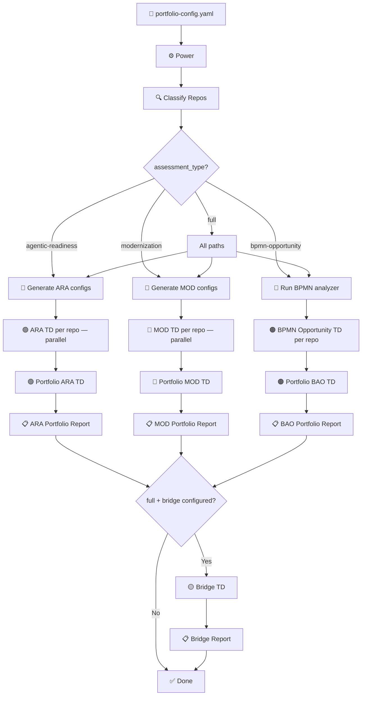
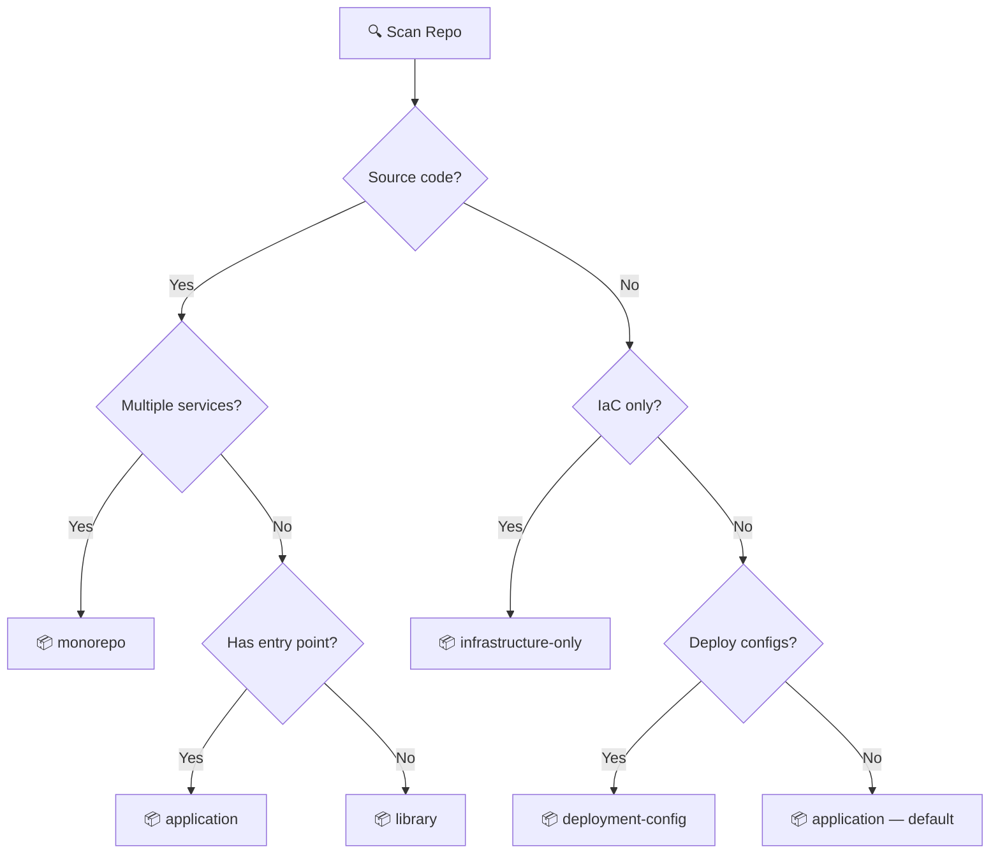
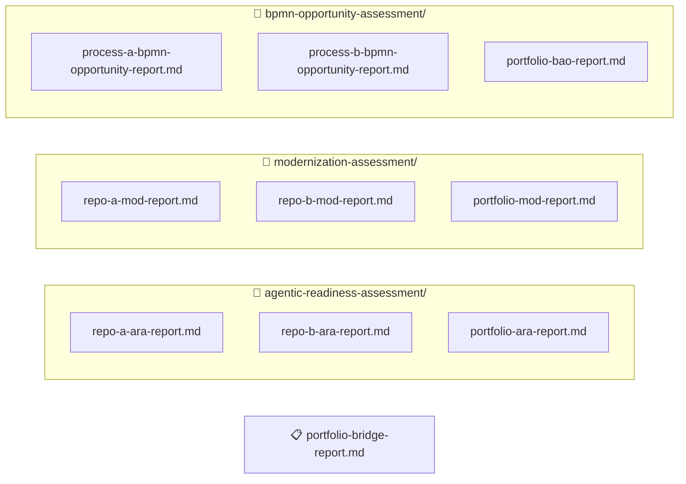
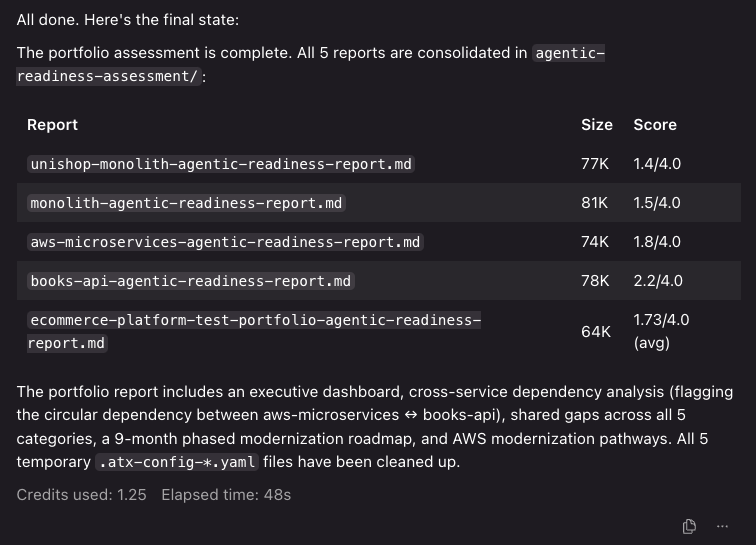

# Agentic Assessment Orchestrator

> Automated assessment of your service portfolio for agentic AI readiness, cloud-native modernization, and agentic opportunity identification from BPMN process models -- three dedicated assessments (ARA + MOD + BAO) with portfolio-level cross-cutting analysis, dependency-aware roadmaps, a unified bridge report, and consolidated reports.

This project provides six [AWS Transform](https://docs.aws.amazon.com/transform/) (ATX) custom transformation definitions and a [Kiro](https://kiro.dev) Power that orchestrates them across multiple repositories.

## Architecture

There are two layers:

1. **ATX Custom Transformation Definitions** — the assessment logic published to your AWS Transform registry (6 TDs)
2. **Kiro Power** — an orchestrator that reads `portfolio-config.yaml`, classifies repos, generates ATX configs, spawns parallel subagents, and consolidates reports

### Three-Assessment Architecture (+ Bridge)

| Assessment | Questions | Scoring | Focus |
|---|---|---|---|
| **ARA** (Agentic Readiness) | 43 across 8 sections | BLOCKER / RISK / INFO | Is this system safe for autonomous AI agents? |
| **MOD** (Modernization Readiness) | 37 across 5 sections | 1-4 scale | How mature is the cloud architecture? |
| **BAO** (BPMN Agentic Opportunity) | Per-task scoring | 4 categories + autonomy levels | Which process steps should become agents? |
| **Bridge** | — | Cross-reference | What work is shared? What's the modernization dividend for agentic readiness? |

Zero question overlap between ARA and MOD. The `assessment_type` field routes which assessments run:
- `agentic-readiness` -> ARA only
- `modernization` -> MOD only
- `bpmn-opportunity` -> BAO only (requires `.bpmn` files)
- `full` -> all assessments in parallel

### Assessment Flow



### Repo Classification

The Power classifies each repo before spawning subagents. Classification determines N/A question mappings in both TDs. User override via `repo_type` in config always takes precedence.



### Config → ATX Config Generation


> `agent_scope` is ARA-only (drives conditional BLOCKERs). `service_archetype` is ARA-only (determines core/extended question tiers). `preferences` is MOD-only (frames recommendations). `repo_type`, `context`, `priority`, and `tags` are shared.

### Report Output



> The bridge report is generated at the portfolio root when `assessment_type: full` and `portfolio_bridge` is configured. It cross-references the ARA, MOD, and (when available) BPMN portfolio reports to produce shared remediation mappings, agentic readiness delta, deduplicated findings, and a BPMN opportunity + ARA readiness matrix.

## Getting Started

### Prerequisites

- Valid AWS credentials (`aws sts get-caller-identity` -- the orchestrator checks this first and fails fast if expired)
- [AWS Transform CLI](https://docs.aws.amazon.com/transform/) installed (`atx --version`)
- [Kiro IDE](https://kiro.dev) with the Agentic Assessment Orchestrator power installed

### Step 1: Publish the ATX Transformation Definitions

```bash
# Individual assessments
atx custom def publish -n agentic-readiness-assessment --sd agentic-readiness-assessment \
  --description "Evaluate a repository against 43 agentic readiness criteria (BLOCKER/RISK/INFO)"

atx custom def publish -n modernization-assessment --sd modernization-assessment \
  --description "Evaluate a repository against 37 modernization readiness criteria (1-4 scale)"

atx custom def publish -n bpmn-opportunity-assessment --sd bpmn-opportunity-assessment \
  --description "Analyze BPMN 2.0 process models to identify agentic AI opportunities with cost estimates"

# Portfolio aggregations
atx custom def publish -n portfolio-agentic-readiness --sd portfolio-agentic-readiness \
  --description "Aggregate ARA reports into portfolio-level cross-cutting analysis"

atx custom def publish -n portfolio-modernization --sd portfolio-modernization \
  --description "Aggregate MOD reports into portfolio-level roadmap and analysis"

atx custom def publish -n portfolio-bpmn-opportunity --sd portfolio-bpmn-opportunity \
  --description "Aggregate BAO reports into portfolio-level opportunity analysis"

# Bridge (optional — for full assessments)
atx custom def publish -n portfolio-bridge --sd portfolio-bridge \
  --description "Cross-reference portfolio ARA and MOD reports into a unified bridge report"
```

Verify: `atx custom def list`

### Step 2: Install the Kiro Power

1. Open Kiro IDE
2. Open the Powers panel
3. Add the `agentic-assessment-orchestrator` power from this repository

### Step 3: Create Your Portfolio Configuration

```yaml
portfolio_name: "my-platform"
assessment_type: "full"
context: "Building customer-facing AI agents while modernizing infrastructure"
agent_scope: "write-enabled"

transformation_definitions:
  agentic_readiness: "agentic-readiness-assessment"
  modernization: "modernization-assessment"
  bpmn_opportunity: "bpmn-opportunity-assessment"
  portfolio_agentic_readiness: "portfolio-agentic-readiness"
  portfolio_modernization: "portfolio-modernization"
  portfolio_bridge: "portfolio-bridge"  # optional — for full assessments

preferences:
  prefer: ["eks", "aurora", "bedrock"]
  avoid: ["self-managed-kafka", "oracle"]

repositories:
  - name: "service-a"
    repository_url: "https://github.com/org/service-a.git"
    path: "./services/service-a"
    priority: "P0"
  - name: "service-b"
    path: "./services/service-b"
    priority: "P1"

dependency_overrides:
  - source: "service-a"
    target: "service-b"
    type: "sync"
    description: "REST API calls"
```

See `portfolio-config.yaml` for a complete example and `portfolio-config.schema.json` for the full schema.

### Step 4: Run the Assessment

In Kiro chat:

```
Run the agentic assessment orchestrator on portfolio-config.yaml
```

Kiro handles cloning, classification, config generation, parallel execution, and report consolidation.



### Step 5 (Alternative): Run Manually Without Kiro

```bash
# Individual ARA (per repo)
atx custom def exec -n agentic-readiness-assessment -p ./services/my-service -g file://atx-config-ara.yaml -x -t

# Individual MOD (per repo)
atx custom def exec -n modernization-assessment -p ./services/my-service -g file://atx-config-mod.yaml -x -t

# BPMN Opportunity (per repo with .bpmn files — run analyzer first)
cd ./services/my-service
python bpmn-opportunity-assessment/bpmn-analyzer/run_analysis.py --bpmn process.bpmn --output analysis.json
atx custom def exec -n bpmn-opportunity-assessment -p . -g file://atx-config-bpmn.yaml -x -t

# Portfolio ARA (after all individual ARA assessments)
atx custom def exec -n portfolio-agentic-readiness -p . -g file://atx-portfolio-ara-config.yaml -x -t

# Portfolio MOD (after all individual MOD assessments)
atx custom def exec -n portfolio-modernization -p . -g file://atx-portfolio-mod-config.yaml -x -t

# Bridge (after both portfolio assessments — full assessment only)
atx custom def exec -n portfolio-bridge -p . -g file://atx-config-bridge.yaml -x -t
```

Always use `-x` (non-interactive) and `-t` (trust all tools) for batch execution.

## Project Structure

```
├── agentic-readiness-assessment/       # ARA TD (43 questions, BLOCKER/RISK/INFO)
│   └── transformation_definition.md
├── modernization-assessment/           # MOD TD (37 questions, 1-4 scale)
│   └── transformation_definition.md
├── bpmn-opportunity-assessment/        # BAO TD (BPMN Agentic Opportunity -- process-level agent classification)
│   └── transformation_definition.md
├── bpmn-analyzer/                      # Deterministic BPMN analysis engine (Python)
│   ├── run_analysis.py                 # Entry point: BPMN file -> JSON report
│   ├── parser/                         # BPMN 2.0 XML parsing (version detection)
│   ├── analyzer/                       # Constraint extraction, dependency discovery
│   │   ├── constraint_extractor.py     # Declarative constraint extraction (13 types)
│   │   ├── dependency_extractor.py     # System dependency discovery from BPMN elements
│   │   ├── exceptions.py              # Exception hierarchy (MalformedBPMN, UnsupportedBPMNVersion, etc.)
│   │   └── vendors/                   # Vendor-specific extractors (auto-discovered)
│   │       ├── camunda_c7.py          # Camunda 7 (camunda:class, delegateExpression, external tasks)
│   │       ├── camunda_c8.py          # Camunda 8 (zeebe:taskDefinition)
│   │       └── jbpm.py                # jBPM/RHPAM (drools:packageName)
│   ├── augmentor/                      # Task scoring, classification, cost estimation
│   ├── samples/                        # Sample BPMN files (loan, KYC, Camunda invoice)
│   ├── tests/                          # 58 tests (parser, constraints, scoring, deps, error handling)
│   └── README.md
├── portfolio-agentic-readiness/        # Portfolio ARA TD (cross-cutting analysis)
│   └── transformation_definition.md
├── portfolio-modernization/            # Portfolio MOD TD (dependency-aware roadmap)
│   └── transformation_definition.md
├── portfolio-bpmn-opportunity/         # Portfolio BAO TD (opportunity aggregation)
│   └── transformation_definition.md
├── portfolio-bridge/  # Bridge TD (ARA + MOD + BAO cross-reference)
│   └── transformation_definition.md
├── agentic-assessment-orchestrator/    # Kiro Power (orchestration logic)
│   └── POWER.md
├── portfolio-config.yaml               # Example portfolio config (full assessment)
├── demo-bpmn-portfolio-config.yaml     # Demo config with open source BPMN repos
├── portfolio-config.schema.json        # JSON schema for portfolio config
├── example-reports/                    # Generated example reports
│   ├── v3-full-assessment/             # Full assessment (ARA + MOD + Bridge) across 5 repos
│   ├── v2-full-assessment/             # V2 assessment for comparison
│   └── online-boutique/               # Online Boutique (11 microservices) with delta tracking
├── dashboard/                          # HTML dashboards (deployed to CloudFront)
│   ├── agentic-readiness.html          # ARA dashboard
│   ├── modernization.html              # MOD dashboard
│   ├── bridge.html                     # Bridge dashboard
│   ├── bpmn-opportunity.html           # BPMN Opportunity dashboard
│   ├── index.html                      # Landing page redirect
│   └── cloudformation.yaml             # S3 + CloudFront hosting template
├── monolith/                           # Test fixture (PHP app for out-of-box testing)
└── static/                             # Static assets
```

## Example Reports

The `example-reports/` directory contains complete sets of reports:

### Full Assessment (5 repos)

```
example-reports/v2-full-assessment/
├── portfolio-config.yaml
├── ecommerce-platform-v2-bridge-report.md
├── agentic-readiness-assessment/
│   ├── MonoToMicroLegacy-ara-report.md
│   ├── aws-microservices-ara-report.md
│   ├── books-api-ara-report.md
│   ├── eks-saas-gitops-ara-report.md
│   ├── monolith-ara-report.md
│   └── ecommerce-platform-v2-portfolio-ara-report.md
└── modernization-assessment/
    ├── MonoToMicroLegacy-mod-report.md
    ├── aws-microservices-mod-report.md
    ├── books-api-mod-report.md
    ├── eks-saas-gitops-mod-report.md
    ├── monolith-mod-report.md
    └── ecommerce-platform-v2-portfolio-mod-report.md
```

### Online Boutique (11 microservices)

```
example-reports/online-boutique/
├── portfolio-config.yaml
├── agentic-readiness.html              # Interactive dashboard (also deployed to CloudFront)
├── modernization.html                  # MOD dashboard
├── agentic-readiness-assessment/       # ARA reports (original code — 43 questions, archetypes)
│   ├── frontend-ara-report.md
│   ├── cartservice-ara-report.md
│   ├── ... (11 individual + 1 portfolio)
│   └── online-boutique-portfolio-ara-report.md
├── agentic-readiness-assessment-v2/    # ARA reports (after remediation — Istio, OTel, etc.)
│   ├── frontend-ara-report.md
│   ├── cartservice-ara-report.md
│   ├── ... (11 individual + 1 portfolio)
│   └── online-boutique-portfolio-ara-report.md
└── modernization-assessment/           # MOD reports
    └── ... (11 individual + 1 portfolio)
```

The two ARA report folders enable delta tracking — comparing assessment results before and after remediation changes (Istio mTLS, OTel, proto versioning, data classification, HPAs, monitoring alerts).

## Dashboard

The `dashboard/` directory contains interactive HTML dashboards deployed to CloudFront:

- **ARA Dashboard** -- Assessment run selector, readiness profiles, cross-cutting analysis, pilot candidate ranking, agentic program recommendations (AgentStorming, AXE, EBA), delta comparison between runs
- **MOD Dashboard** -- Category scores, pathway summary, 4-phase roadmap, technology stack, radar chart
- **Bridge Dashboard** -- Shared remediation mapping, agentic readiness delta, MOD readiness gates, unified remediation sequence
- **BAO Dashboard** -- Agent opportunity classification (build-now / data-first / automate / platform), dependency discovery by vendor, implementation waves, Bedrock consumption forecast

Live at: **https://d2fplme21ym2t.cloudfront.net**

Deploy updates:
```bash
aws s3 sync dashboard/ s3://936068047509-dashboard/ --delete --exclude "cloudformation.yaml" --exclude "README.md" --content-type "text/html"
aws cloudfront create-invalidation --distribution-id E36HDAABDBBG66 --paths "/*"
```

## Local Monolith (Test Fixture)

The `monolith/` directory contains a simple PHP application used as a test fixture so you can run assessments out of the box without cloning external repos.

## Managing Transformation Definitions

```bash
# List
atx custom def list

# Update (delete + re-publish)
atx custom def delete -n agentic-readiness-assessment
atx custom def publish -n agentic-readiness-assessment --sd agentic-readiness-assessment \
  --description "Evaluate a repository against 43 agentic readiness criteria (BLOCKER/RISK/INFO)"

# Update bridge TD
atx custom def delete -n portfolio-bridge
atx custom def publish -n portfolio-bridge --sd portfolio-bridge \
  --description "Cross-reference portfolio ARA and MOD reports into a unified bridge report"

# Get details
atx custom def get -n agentic-readiness-assessment
```

## Contributing

We welcome contributions that improve existing transformation definitions or propose new ones. Use the GitHub issue templates:

- **[Improve Existing TD](../../issues/new?template=improve-transformation-definition.yml)**
- **[Propose New TD](../../issues/new?template=new-transformation-definition.yml)**

See [CONTRIBUTING.md](CONTRIBUTING.md) for general guidelines.

## Security

See [SECURITY.md](SECURITY.md) for security guidelines and [THREAT_MODEL.docx](THREAT_MODEL.docx) for the threat analysis. Treat assessment reports as confidential — they contain architecture details.

## Related Resources

- [AWS Transform Documentation](https://docs.aws.amazon.com/transform/)
- [AWS Transform CLI Reference](https://docs.aws.amazon.com/transform/latest/userguide/custom-command-reference.html)
- [AWS Modernization Pathways](https://skillbuilder.aws/learning-plan)
- [Cloud Design Patterns](https://docs.aws.amazon.com/prescriptive-guidance/latest/cloud-design-patterns/)
- [AWS Well-Architected Framework](https://aws.amazon.com/architecture/well-architected/)

## License

This library is licensed under the MIT-0 License. See the [LICENSE](LICENSE) file.
