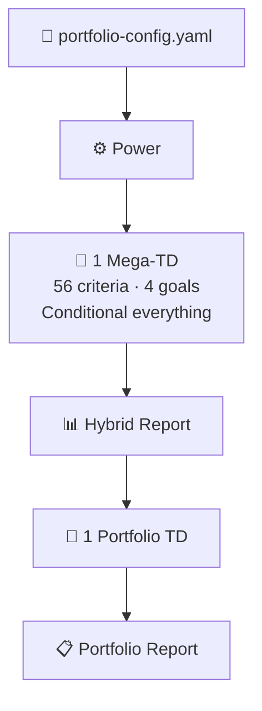
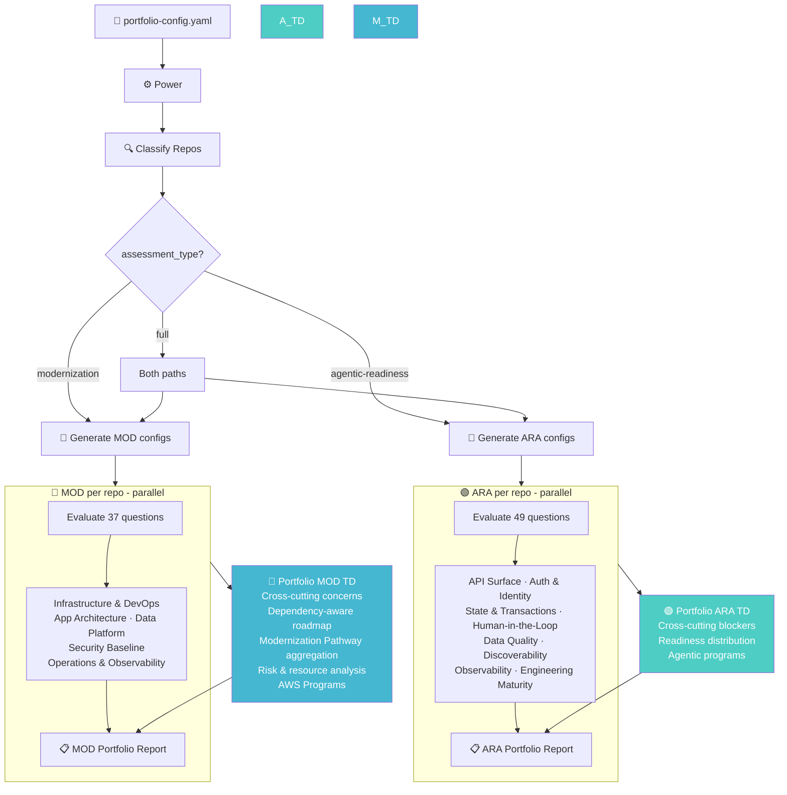
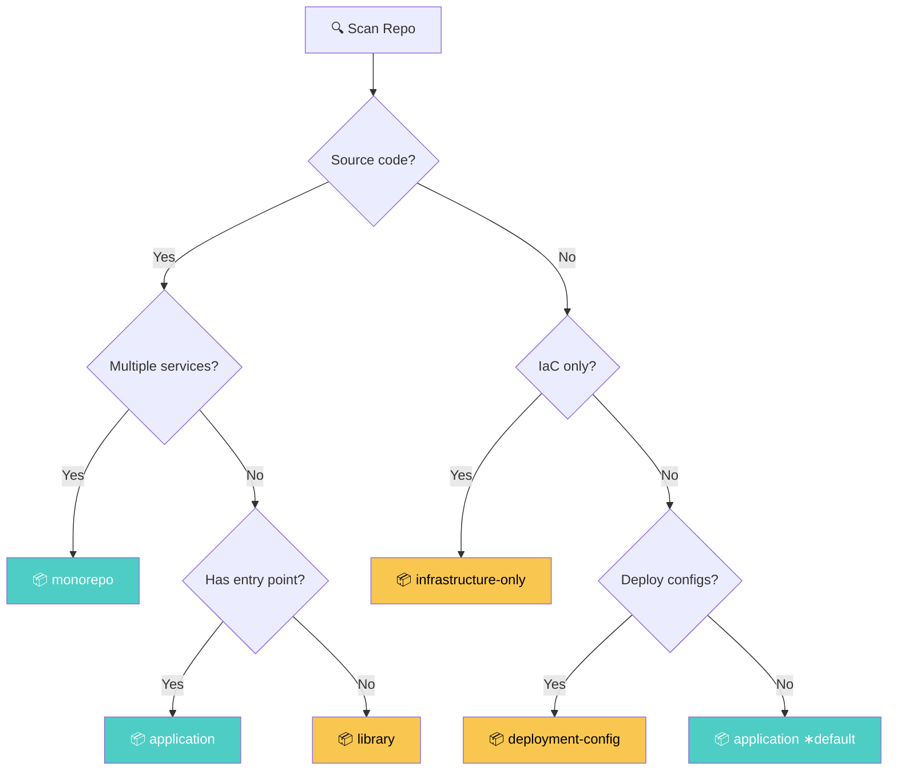
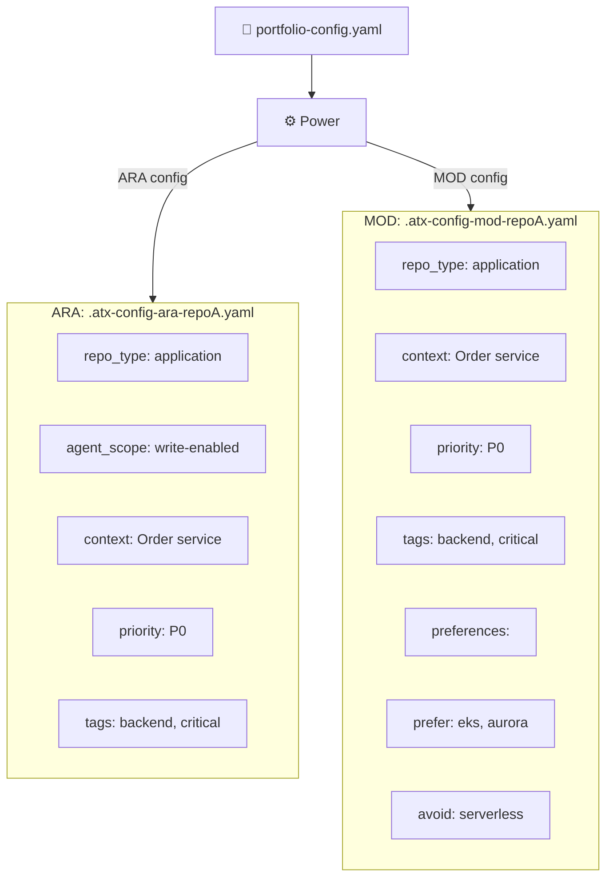
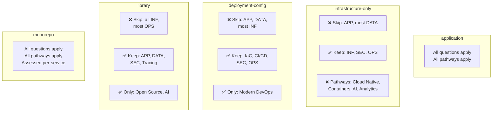
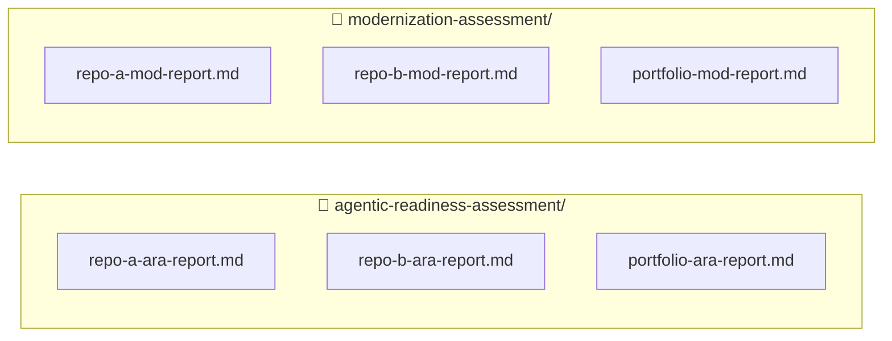

# Assessment Architecture Flow

## Current State

## Target State

## Repo Classification

## Config Flow: Portfolio YAML → Per-Repo ATX Configs

> **Note:** `agent_scope` is ARA-only (drives conditional BLOCKERs). `preferences` is MOD-only (frames recommendations). `repo_type`, `context`, `priority`, and `tags` are shared by both.

## N/A Mapping: What Gets Skipped

## Report Output

