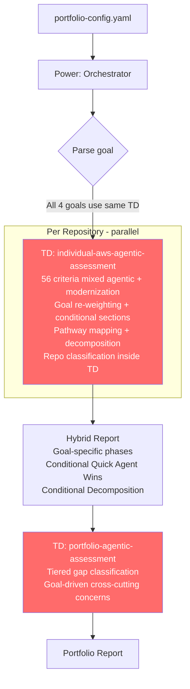
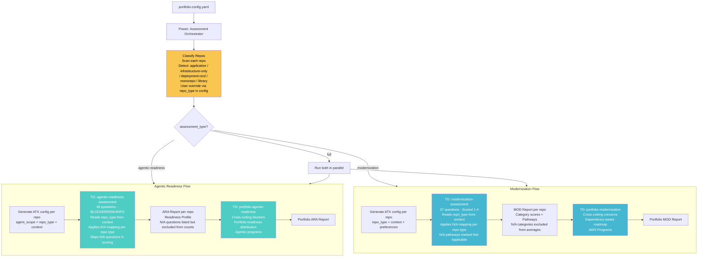
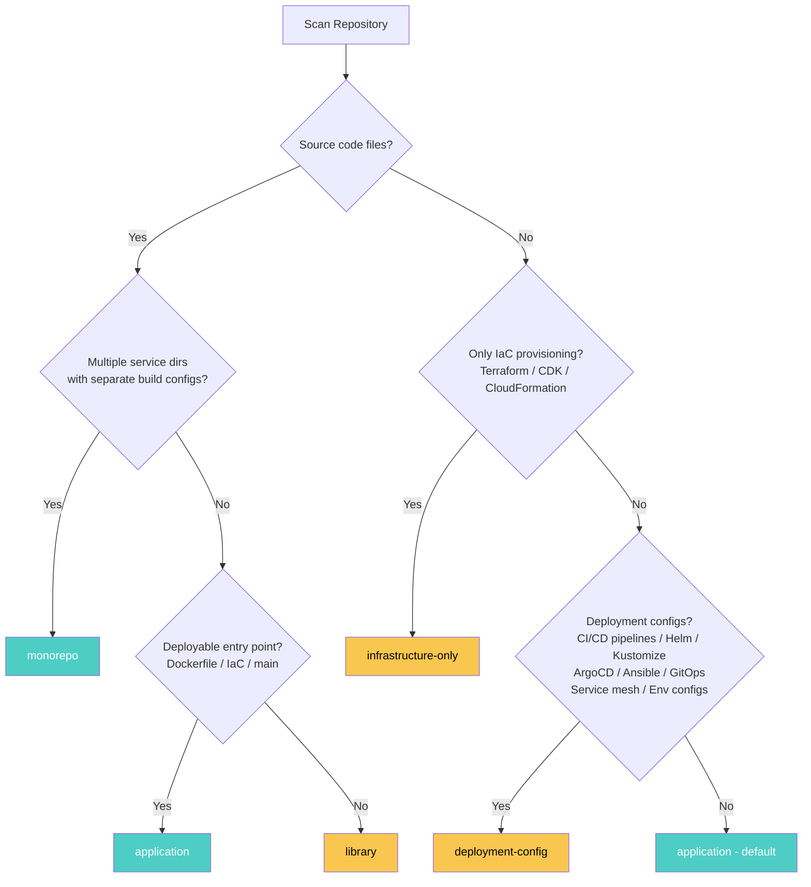
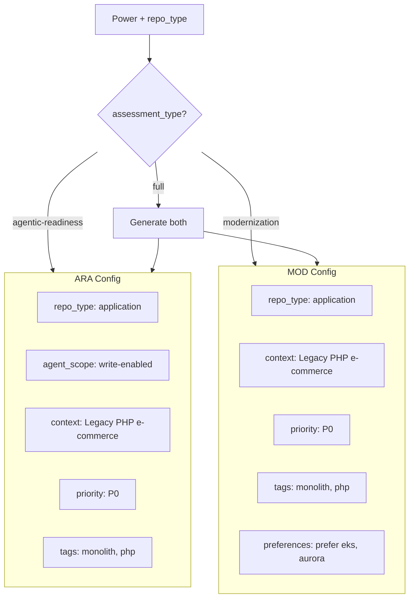
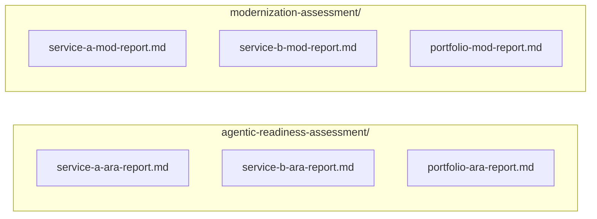
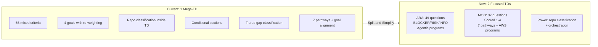

# Assessment Architecture Flow

## Current State (Today)

---

## Target State (New Architecture)

---

## Repo Classification (Power Responsibility)

---

## Per-Repo ATX Config Generation

---

## Report Output Structure

---

## Old vs New Comparison

