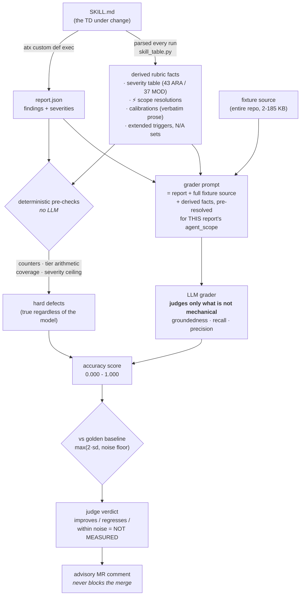

# Change-Impact Harness — Operator Guide

The harness gives contributors automatic, advisory feedback on any change to one of
the four **managed** AWS Transform TDs (`agentic-readiness-analysis`,
`modernization-readiness-analysis`, `portfolio-agentic-readiness-analysis`,
`portfolio-modernization-readiness-analysis`). On each merge request it re-runs the
changed TD over a representative set of fixtures, computes a deterministic D1–D5
delta versus committed golden baselines, re-scores the regenerated reports for accuracy,
and has an LLM-as-judge decide **whether that delta makes the analysis better or worse**
— posting the verdict as an MR comment. It never blocks a merge. For the full design
(dimensions, differ contract, trigger model), see [`DESIGN.md`](./DESIGN.md).

**There is one score, on one scale.** `score-reports.py` grades a report's **accuracy** —
how well it is grounded in the fixture's actual source, with misses (recall) and
fabrications (precision) counting against it, weighted so a missed BLOCKER costs far more
than a spurious INFO. That produces a number from **0.000 to 1.000**. The committed
baseline in [`golden-accuracy-baseline.json`](./golden-accuracy-baseline.json) is exactly
that measurement over the golden reports, published in [`SCORES.md`](./SCORES.md).

On a merge request the **same scorer** re-scores the reports the *changed* TD just
produced, the same way. The judge does not invent a second scale — it consumes those two
numbers and reasons about the **direction**:

| Measured move | What the judge reports |
| --- | --- |
| `delta >= threshold` | a measured accuracy **improvement** |
| `|delta| < threshold` | **within noise — NOT MEASURED**, reported as neutral |
| `delta <= -threshold` | a measured accuracy **regression** |

`threshold` is per fixture and comes from the data: **`max(2·stddev, noise floor)`**, where
the floor is ARA **0.25** / MOD **0.03** (measured by re-running the analysis, not by
re-scoring fixed reports). Measured variance may only **raise** the bar, never lower it — an
n=3 stddev is too weak an estimator to justify shrinking the threshold, and shrinking it
manufactures false "improved" verdicts. A sub-threshold move is a different roll of the dice,
not a result — which is why the harness re-baselines from several independent runs rather than
one draw. A baseline with fewer than 2 scored runs reports `stddev` as `—` (**not measured**),
never `0.000`, so a fake zero can never produce a zero threshold.

If the regenerated report was **not** scored there is no accuracy number and no
comparison, so the change **cannot be validated**. That is reported as a harness error to
fix (`verdict: needs-work`), never as a pass and never as a substituted number.

The contributor's stated intent is reported as supporting evidence, but does **not** drive
the measurement: a change can be described perfectly and still degrade the analysis. See
[`DESIGN.md` §6.1](./DESIGN.md) for the calibration ladder.

> **Automation is GitLab-only.** All CI runs on `gitlab.aws.dev`, where AWS access
> is granted via the **AWS Credential Vendor** (see below). GitHub stays open for
> issues and PRs but runs no automation.

## Set up AWS access (AWS Credential Vendor — no long-lived credentials)

The `atx` (AWS Transform) step needs AWS access on the GitLab runner.

> **Why not OIDC?** On the *public* GitLab, the usual pattern is an IAM OIDC
> provider that trusts the instance. That does **not** work on the internal
> `gitlab.aws.dev`: AWS IAM cannot reach the private instance to verify the
> `id_token`, so OIDC is not an option here.
> ([ref](https://w.amazon.com/bin/view/Users/dnchi/AWSGitLab/))

Instead we use the **AWS Credential Vendor**, which is built into the **shared
runner fleet**. The runners' jump role
`arn:aws:iam::979517299116:role/gitlab-runners-prod` assumes a role **you** create
in your Isengard account, gated by GitLab principal tags. The runner then injects
temporary `AWS_ACCESS_KEY_ID` / `AWS_SECRET_ACCESS_KEY` / `AWS_SESSION_TOKEN` into
the job automatically — there is nothing to exchange in `before_script`, and no
static keys are stored. Two constraints:

- It **only works on the shared runner fleet** (already the case here). Do **not** add
  `tags: [shared]` — there is no GitLab tag by that name; untagged jobs are picked up by
  the default shared fleet automatically, which is where the Vendor runs. Adding a bogus
  tag leaves the job stuck with no matching runner.
- The role is **per-project** — it cannot be reused across GitLab projects.

### 1. Create the IAM role in your Isengard account

Create a role whose **trust policy** lets the shared-runner jump role assume it,
scoped to *this* GitLab group + project via principal tags. Replace `<GROUP>` and
`<PROJECT>` with this project's path segments — for
`gitlab.aws.dev/agentic-readiness-assessment/agentic-readiness-assessment` that is
group `agentic-readiness-assessment`, project `agentic-readiness-assessment`:

```json
{
  "Version": "2012-10-17",
  "Statement": [
    {
      "Effect": "Allow",
      "Principal": {
        "AWS": "arn:aws:iam::979517299116:role/gitlab-runners-prod"
      },
      "Action": [
        "sts:AssumeRole",
        "sts:TagSession"
      ],
      "Condition": {
        "StringEquals": {
          "aws:PrincipalTag/GitLab:Project": "<PROJECT>",
          "aws:PrincipalTag/GitLab:Group": "<GROUP>"
        }
      }
    }
  ]
}
```

One-liner to create it (run with your Isengard admin credentials; save the trust
policy above as `trust.json`):

```sh
aws iam create-role \
  --role-name ara-harness-gitlab-access \
  --description "GitLab shared runners -> ARA change-impact harness analysis access" \
  --assume-role-policy-document file://trust.json
```

### 2. Attach a least-privilege permissions policy

Give the role **only** the AWS actions the analysis needs (the `atx` / AWS Transform
calls and supporting read access). Keep it **analysis-scoped, not admin** — no
write/delete on unrelated resources, no `AdministratorAccess`. Attach it with
`aws iam put-role-policy` (inline) or `attach-role-policy` (managed).

### 3. Add the GitLab CI variables

Click-path (GitLab project on `gitlab.aws.dev`): **Settings → CI/CD → Variables →
Add variable**.

| Variable | What it is | Masked | Protected |
|---|---|---|---|
| `AWS_CREDS_TARGET_ROLE` | ARN of the IAM role created in step 1 — the trigger the Credential Vendor keys off | **No** | **No — must stay Plain** |
| `AWS_DEFAULT_REGION` | Region for the analysis run (`us-east-1`) | **No** | **No — must stay Plain** |

Notes:

- `AWS_CREDS_TARGET_ROLE` is the **only** switch — when it is set, the shared runner
  vends creds for it automatically; when it is unset, the job logs a clear warning
  and no AWS access is granted.
- **Both variables MUST stay Plain — not Protected, not Masked.** This is the failure we
  actually hit. A *Protected* variable is injected **only on protected branches**, so it is
  silently absent on the feature branches and MRs where this harness runs — no creds, no
  analysis, no error explaining why. A *Masked* / *Hidden* variable can't be read by the
  runner's pre-clone vendor script at all. Neither value is a secret (an ARN and a region),
  so there is nothing to protect. `harness:auth-check` diagnoses both cases.
- **The variable is `AWS_DEFAULT_REGION`, not `AWS_REGION`.** The vendor gates on
  `AWS_DEFAULT_REGION` specifically and vends only when it *and*
  `AWS_CREDS_TARGET_ROLE` are set. Setting only `AWS_REGION` makes the vendor skip
  silently — confirmed by zero AssumeRole attempts in the target account's CloudTrail.
- **No token to refresh.** The Vendor removes the old Isengard session-token expiry
  pain — no static keys to rotate; fresh short-lived credentials on every run.
- **Multiple roles/stages?** If you later split analysis across accounts, each job
  can set its own `AWS_CREDS_TARGET_ROLE` value and the Vendor assumes accordingly.

## How it runs

Five jobs, **every one `allow_failure: true`** — the harness is advisory and never blocks a
merge. See [`.gitlab-ci.yml`](../.gitlab-ci.yml).

- **`harness:contract-tests`** — the offline guardrail (no AWS, no fixtures, no creds). Runs
  the **whole** test suite (`python3 -m pytest harness/tests/ -q`) on every MR and web run:
  the JSON-contract validator, the differ, the envelope normalizer, the scorer, and the
  `SKILL.md` parse (`test_skill_table.py` asserts 43/37 questions and AUTH-Q5's class). That
  parse is what tells the differ a `BLOCKER → RISK-SAFETY` move is a *correction*, so a TD
  heading-format change that broke it would silently disable over-escalation detection —
  these tests are what catch that. This is the structural axis, distinct from the semantic
  judge.
- **`harness:auth-check`** — reports whether the Credential Vendor actually vended
  credentials, so "no creds" is distinguishable from "role trust rejected".
- **`harness:comment-check`** — **manual** on an MR. Renders the advisory comment from a
  canned verdict in ~30s, so the comment path can be tested without a full analysis run.
- **`harness:impact`** — runs automatically on every merge request. A deterministic
  gate (`should-run.sh`) decides run vs skip: it RUNs when a change lands under a
  watched TD directory (`definitions/managed/<td>/`, configurable via `HARNESS_TD_PATHS`)
  or a fixture; otherwise it skips. It publishes the edited TD as a custom def and runs
  it over the changed fixtures (`--changed-only --validate`), diffs against `golden/`,
  and the judge scores the delta's **effect on the analysis**, reading the **MR
  description** (per the TD-change MR template) as intent evidence. The verdict is
  posted as an MR comment.
- **`harness:full`** — manual only, via the **Run pipeline** button (web-triggered).
  Use it to force a full re-baseline (e.g. after publishing an approved change). Set
  `CHANGED_TD`, `RUN_SCOPE` (default `all`), and `RUN_INTENT` when launching. With no
  MR, it prints the verdict instead of commenting.

Both analyze jobs emit `impact.json` and `verdict.json` as artifacts.

## Local dev

You can exercise the differ without AWS or `atx` — it only reads report JSON:

```sh
# Diff two report trees (e.g. a hand-made "after" vs the committed goldens),
# using the committed golden baseline as input.
harness/diff-reports.py \
  --baseline harness/golden \
  --after harness/golden \
  -o /tmp/impact.json
# (Same tree in/out => an all-empty delta with "no_op": true — a good smoke test.)

# Run the full offline suite — the same command CI runs.
python3 -m pytest harness/tests/ -q
```

`judge.py` is the only component that needs an LLM; the gate, differ, and coverage
heatmap (`coverage-heatmap.py`, rendered from `usecases.yaml` axes) all run offline.

Anything that regenerates reports **does** need AWS + `atx`. Two flags worth knowing:

```sh
# Re-run ONE fixture (fast iteration, or backfill one a transient failure dropped
# from a batch). --force is required to write into a dir that already holds reports.
harness/run-fixtures.sh --scope all --td ara --no-portfolio --skip-publish \
  --after-dir /tmp/mybatch --only monolith --force --jobs 8

# Print the atx commands without executing — offline sanity check of the selection.
harness/run-fixtures.sh --scope all --td ara --only monolith --dry-run
```

## Where the scores live (`SCORES.md`)

[`SCORES.md`](./SCORES.md) is the readable score table for every fixture — accuracy
score, deterministic check status, and the grader's fabrications/misses per report.
It is **generated** from `golden-accuracy-baseline.json`, never hand-edited:

```sh
# Free — reads the committed baseline, no Bedrock, no analysis run.
harness/score-reports.py --show-baseline --markdown
```

Add `--markdown` to any `--update-baseline` run and the doc is refreshed with the JSON,
so the two cannot disagree. The file states its own **sample depth**, which governs how
far the numbers can be pushed: at one run per fixture there is no measured variance, so
ARA falls back to its 0.25 noise floor and its scores cannot rank fixtures against each other.

## Severity is read from the TD, never transcribed (`skill_table.py`)

`skill_table.py` parses the question/severity tables straight out of the two managed
`SKILL.md` files, and both the differ and the judge reason from that one parse. A hardcoded
copy goes stale *silently* the moment someone edits a severity — precisely the drift this
harness exists to catch.

### How a report gets scored

The TD is the single source of truth for *both* sides: it produces the report, and the rules
for grading that report are parsed back out of the same file on every run. Nothing about the
rubric is transcribed by hand.



**Why the derived facts are in the prompt at all.** They are *additive context, not scoring
policy* — the rubric still decides what matters. Every fact injected is something
**deterministic** the grader would otherwise have to re-derive, and derived *inconsistently*
when it did: on `legacy-storefront-rails` it talked itself in and out of one call inside a
single sentence (*"AUTH-Q6 … should be BLOCKER … which is actually correct"*). Resolving 9
scope-dependent questions per report is mechanical work; handing it to an LLM buys only
variance. Worse, without the rubric the grader fell back on general AppSec instinct and
demanded BLOCKER for 6 findings correctly filed as `DATA-Q4` — which is RISK-QUALITY *by
definition*. It was grading against a rubric it had never been shown.

So the work splits three ways: **arithmetic** goes to the deterministic checks (an LLM should
never be asked to *probably* catch a miscount), **rubric lookup** is pre-resolved into the
prompt as authoritative, and only **judgement** — is this evidence really in the source, is
this severity consistent with the finding text — reaches the model.

One deliberate exception: `DATA-Q1`'s Stage-A/B ladder and the calibration rules are handed
over as **prose**, not compiled into predicates. They are nested boolean conditions and a
multi-layer ladder whose severity is the highest layer that fires; a regex that tried to
evaluate them would be the least trustworthy part of this harness. `parse_calibrations`
therefore returns the TD's own wording verbatim, paired with the report's actual flag values,
keeping the deterministic part (which flags are set) separate from the judgement (does this
rule fire).

This is what lets the differ tell two very different events apart:

| Movement | How it reads | Holds? |
|---|---|---|
| `API-Q1` BLOCKER → RISK-SAFETY | genuine relaxation (API-Q1 *is* an unconditional BLOCKER) | **yes** — `tier_relaxed` |
| `AUTH-Q5` BLOCKER → RISK-SAFETY | **correction** — the TD documents AUTH-Q5 as RISK-SAFETY, so the BLOCKER was an over-escalation | no — `over_escalation_corrected` |

Without that distinction the harness scored a *correctness fix* as damage: correcting AUTH-Q5
across 6 fixtures returned `40 / degrades / safety_hold`, because losing a blocker
mechanically relaxes the tier. It now returns `88 / improves / LGTM`. A downgrade is only a
degradation when the original severity was **right**.

The guard is conservative by design. A move is only excused when the TD gives the question a
fixed severity, the "before" was strictly *more* severe than documented, and the "after"
lands *exactly* on it. So it never excuses the 9 scope-dependent (⚡) questions, and never
excuses an **under**-statement — the dangerous direction still alerts.

**One report tree is a draw, not a measurement.** The analysis agent moves 10–20 findings per
fixture per re-run, so a single golden tree cannot separate "the TD improved" from "the agent
rolled differently". That is why the safety alerts above are computed from the rubric's own
arithmetic rather than inferred from findings churn — and why the baseline is worth
re-establishing from several independent runs rather than one.
